

    
   
  <em>End-to-end autonomous software design, implementation, and adversarial review in a single pipeline</em>

# Supreme Team

- **Admiral orchestration** — one front door for design, build, review,
  investigation, release, resume, and skill/team creation across **47 skills**.
- **Save protocol** — persisted runs, resumable checkpoints, audit trails, and
  recoverable handoffs in `skillset-saves/`.
- **Runtime harness** — hook-based routing reinforcement, guarded writes,
  dangerous-command checks, and failure-trajectory recovery hints.
- **Gated pipelines** — design, build, review, browser automation, release,
  safety, testing, and QA workflows with clear ownership boundaries.
- **Adversarial review** — gatekeepers, bug/security/quality/frontier lenses,
  cso and mr-robot pressure testing, and fail-loud deterministic checks.
- **Templates and doctrine** — grill-me intake, shadcn/ui component templates,
  API contracts, handoff templates, and reusable skill-maker packaging patterns.

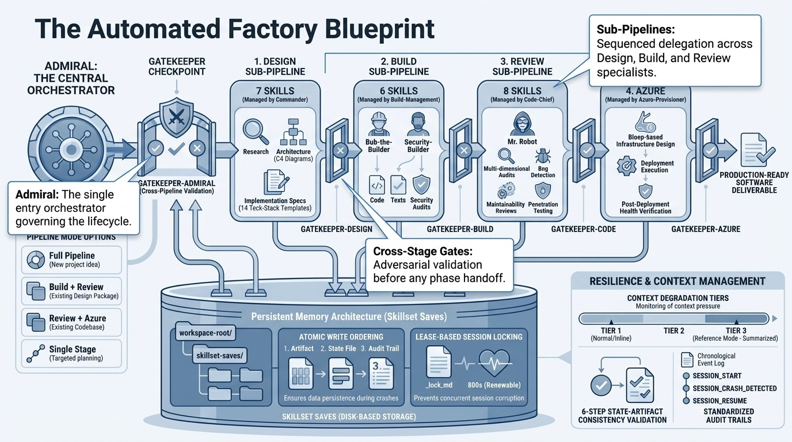

## Why Supreme Team

**Without Supreme Team**, asking an AI assistant to "build me an app" produces a
single-pass attempt with no structured validation, no adversarial review, and no
way to resume if the conversation ends mid-task.

**With Supreme Team**, the same request enters through one front door
(**admiral**) and flows through a phased pipeline where each deliverable is
challenged by adversarial gatekeepers before the next phase begins. Design specs
are validated before code is written. Code is security-audited before review.
Review findings are evidence-checked before delivery. Every artifact is saved to
disk for cross-session resume and audit, and a runtime harness deterministically
blocks dangerous actions and steers lifecycle work through the orchestrator.

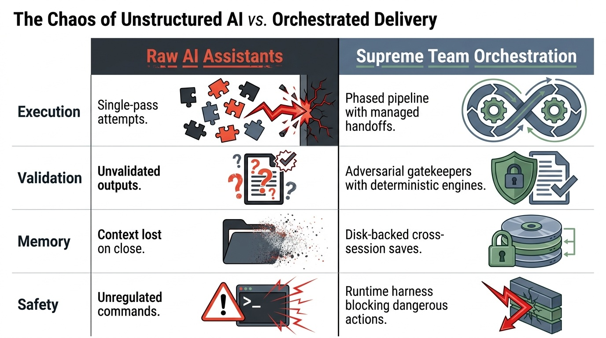

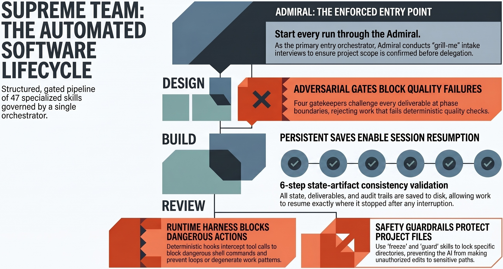

### What You Get

- **One enforced entry point** — admiral is the primary entry orchestrator; tell
  it what you want and it routes through the right phases under one intake, one
  persisted run, and one cross-stage gate
- **Adversarial quality gates** — four gatekeepers challenge every deliverable,
  backed by a deterministic gate engine; approval is earned, never assumed
- **Runtime harness** — stdlib hooks block dangerous commands and guarded-path
  writes, detect degenerate trajectories, and reinforce entry routing
- **Cross-session persistence** — pipeline state, deliverables, and audit trails
  are saved to disk so you can resume exactly where you left off
- **Flexible execution** — run the full pipeline, any subset of phases, individual
  skills, or the standalone tool groups
- **Skill & team creation** — skill-maker drafts, evals, reviews, and packages new
  Claude skills and coordinated skill teams
- **No platform lock-in** — plain Markdown files that work with any AI tool that
  reads skill definitions

## Skills and Orchestrators

Supreme Team contains **47 skills**: a three-stage delivery pipeline managed by
sub-orchestrators under the top-level **admiral**, three cross-cutting
Admiral-pipeline components, and four standalone tool groups.

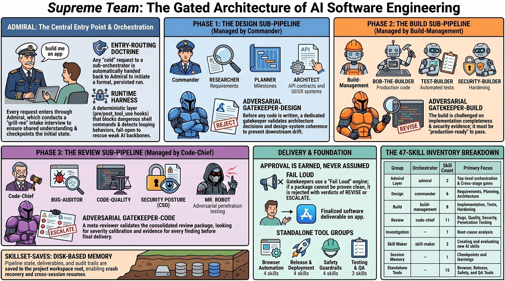

| Group | Orchestrator / Tier | Skills | Purpose |
|-------|---------------------|--------|---------|
| **Admiral Layer** | admiral | 2 | Top-level orchestration + cross-stage validation |
| **Design** | commander | 6 | Requirements, planning, architecture, API contracts, design system, impl spec |
| **Build** | build-management | 8 | Implementation, testing, security hardening, completeness, debugging, health |
| **Review** | code-chief | 11 | Bug detection, code quality, security, security leadership, pen-testing, frontend, visual QA, DX |
| **Investigation** | — (in-scope) | 1 | Disciplined root-cause analysis |
| **Skill Maker** | skill-maker | 3 | Create, review, and package Claude skills and teams |
| **Session Memory** | — (in-scope) | 1 | Cross-session checkpoints and accumulated learnings |
| **Browser Automation** | standalone | 4 | Launch, drive, authenticate, and share a browser session |
| **Release & Deployment** | standalone | 4 | Release orchestration, merge-and-deploy, deploy config, release notes |
| **Safety Guardrails** | standalone | 4 | Intent checks and write-boundary locks (guard / careful / freeze / unfreeze) |
| **Testing & QA** | standalone | 3 | Test-and-fix QA, report-only QA, performance benchmarking |

Every pipeline sub-orchestrator delegates to its specialists in sequence and
validates each phase through its own gatekeeper before advancing.

See [docs/skills.md](docs/skills.md) for the complete inventory and
[docs/architecture.md](docs/architecture.md) for the pipeline flow.

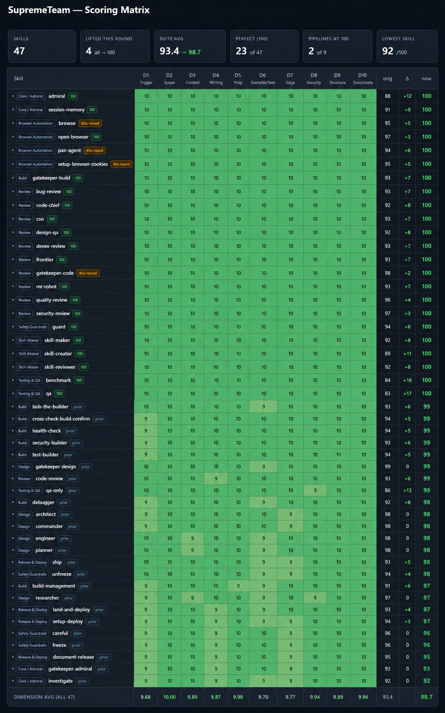

## Entry Routing

**admiral** is the single front door for the entire delivery lifecycle. The
entry-routing doctrine fixes the gap that descriptions alone cannot close: a
request like "design this system" or "investigate this bug" is initiated through
admiral so the run gets one intake, one persisted state, and one cross-stage
gate. In-scope skills reached cold hand off to admiral first; standalone tools
(Tier 4) run directly. A `UserPromptSubmit` hook reinforces this deterministically
once registered.

See [docs/routing.md](docs/routing.md) for the tiers, precedence, and loop guard.

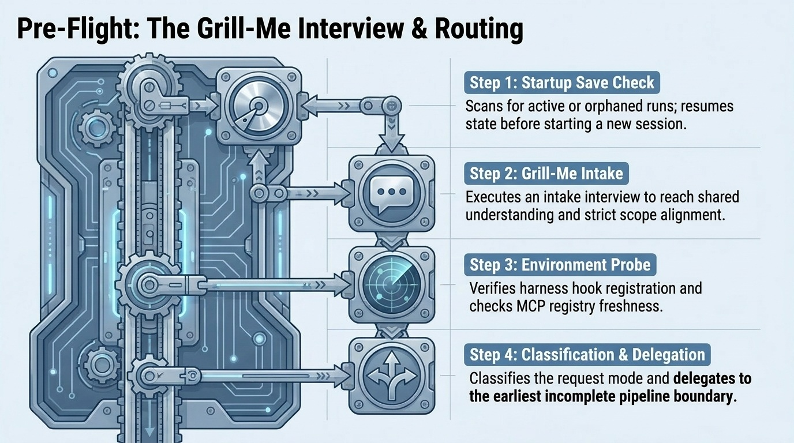

## How Gatekeepers Work

Supreme Team enforces quality through **four adversarial gatekeepers** at two
levels. Per-phase gatekeepers (`gatekeeper-design`, `gatekeeper-build`,
`gatekeeper-code`) validate work within their sub-pipeline. The cross-stage
gatekeeper (`gatekeeper-admiral`) validates at the boundaries between stages. A
fifth adversarial gate, `skill-reviewer`, scores skills inside the skill-maker
pipeline. Every gatekeeper is backed by a shared deterministic gate engine that
turns mechanically checkable conditions into a fail-loud pass.

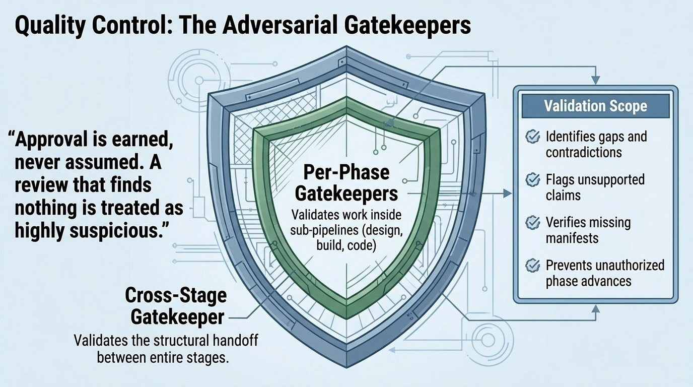

Every gatekeeper verdict is one of:
- **APPROVED** — advance to the next phase
- **REVISE** — return with specific findings to address (max 2 cycles)
- **ESCALATE** — surface the blocking issue to the user

A review that finds nothing is treated as the most suspicious review of all.

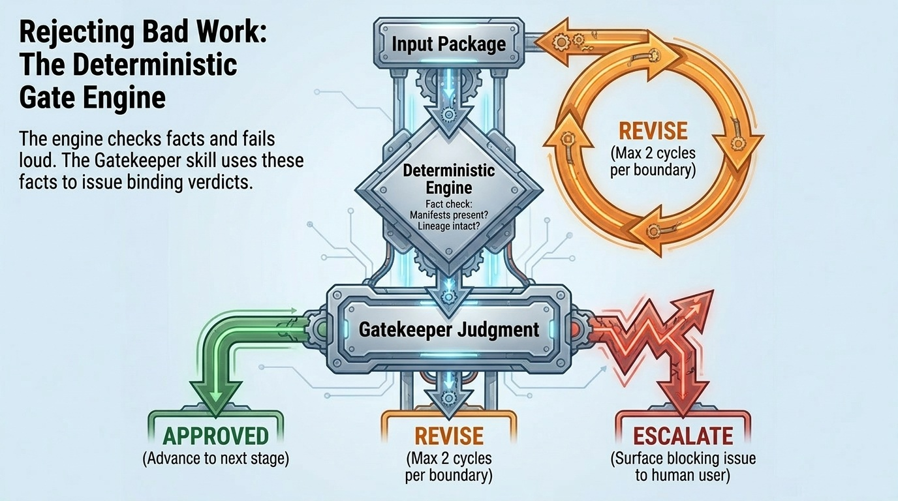

See [docs/gatekeepers.md](docs/gatekeepers.md) for the full pattern.

## Runtime Harness

A stdlib-only runtime harness deterministically enforces the parts of the
contract that can be checked mechanically: `pre_tool_use.py` blocks dangerous
commands and writes into a frozen/guarded boundary, `post_tool_use.py` detects
degenerate trajectories and injects a recovery hint, and `user_prompt_submit.py`
reinforces entry routing. The hooks **fail open**; the gatekeeper gate engine
**fails loud**. Hook registration is explicit opt-in and uses each host's native
configuration or plugin mechanism.

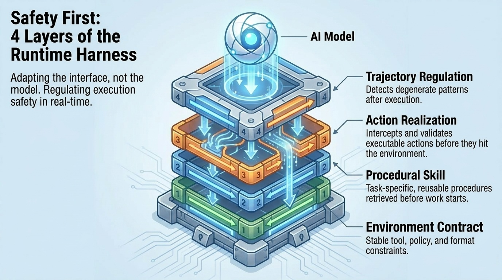

See [docs/harness.md](docs/harness.md) and `skills/harness-doctrine.md`.

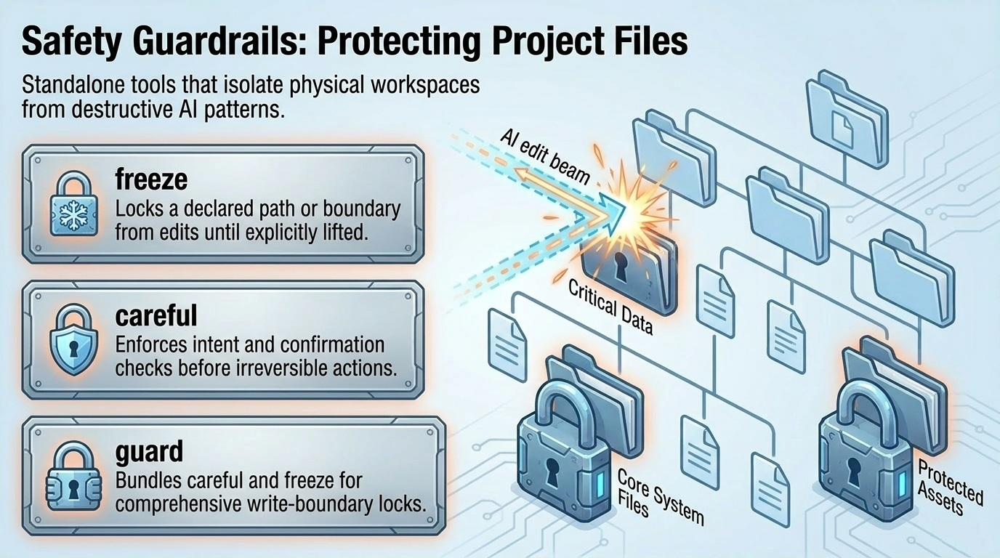

## Persistent Saves

Pipeline state is automatically saved to `skillset-saves/` in your project
workspace as the pipeline runs, providing cross-session resume, crash recovery
(lease-based locking, idempotent gatekeeper submissions), a chronological audit
trail, deliverable backup, and graceful degradation if saves fail.

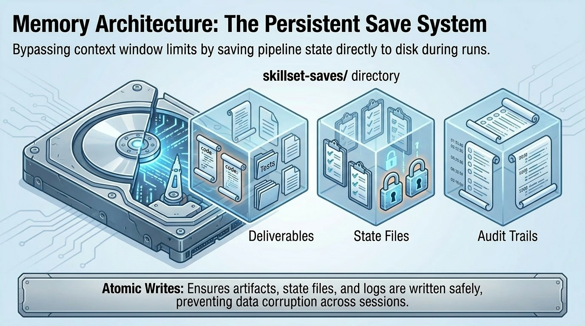

See [docs/persistent-saves.md](docs/persistent-saves.md) for details.

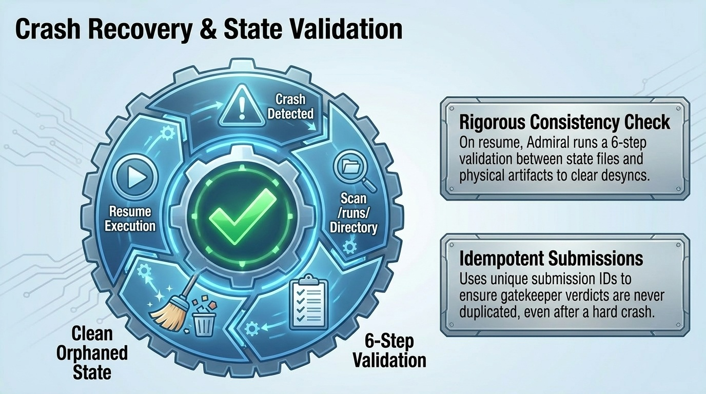

## Limitations

- **Context window dependent** — large projects can exceed an AI assistant's
  context window. The save system mitigates this with reference-mode tiers, but
  very large codebases may still require manual chunking.
- **LLM accuracy** — the pipeline enforces structure and adversarial review, but
  output quality is bounded by the underlying model. Gatekeepers catch many
  issues but are not infallible.
- **No runtime execution** — Supreme Team generates artifacts (code, configs,
  runbooks) and orchestrates release flows, but a human or CI system runs the
  actual deployment commands the release tools produce.
- **Hook enforcement is host-dependent** — deterministic entry routing and action
  guards require the runtime harness hooks to be registered for the active host.
  Without them, those layers fall back to advisory doctrine.
- **Single-session concurrency** — the lease-based lock system is advisory.
  Running two sessions against the same project simultaneously can cause
  conflicts.

## Quick Start

See [QUICK-START.md](QUICK-START.md) for installation steps and first-use
instructions.

## Documentation

| Document | Description |
|----------|-------------|
| [QUICK-START.md](QUICK-START.md) | Installation and first-use guide |
| [Install.md](Install.md) | Detailed installation procedure (AI-agent and manual) |
| [AGENTS.md](AGENTS.md) | Authoritative skill manifest for tool discovery |
| [docs/architecture.md](docs/architecture.md) | Pipeline architecture, flow diagrams, and execution modes |
| [docs/skills.md](docs/skills.md) | Complete skill inventory |
| [docs/routing.md](docs/routing.md) | Entry-routing doctrine and skill tiers |
| [docs/gatekeepers.md](docs/gatekeepers.md) | Gatekeeper pattern and the deterministic gate engine |
| [docs/harness.md](docs/harness.md) | Runtime harness: hooks and gate engine |
| [docs/persistent-saves.md](docs/persistent-saves.md) | Save system, resume, and audit trails |
| [docs/direct-invocation.md](docs/direct-invocation.md) | Standalone skill usage and routing tiers |
| [docs/directory-structure.md](docs/directory-structure.md) | Repository and installed layout reference |

---

    Built by <a href="https://github.com/TykoDev">TykoDev</a> · Supreme Team

