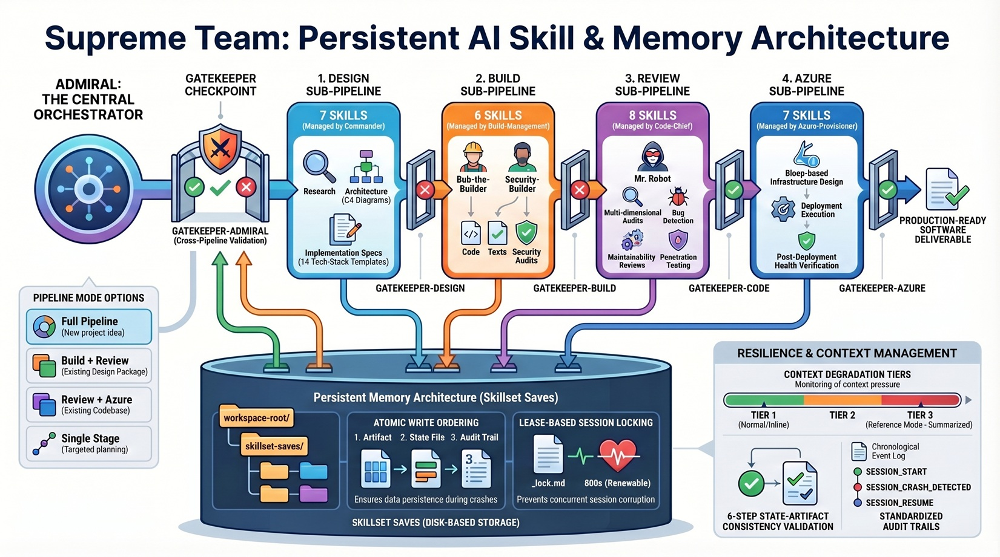

    
   
  <em>End-to-end autonomous software design, implementation, and review in a single pipeline</em>

# Supreme Team

Supreme Team is an AI skill system that drives a complete software lifecycle —
design, build, adversarial review, and Azure deployment — through a single
orchestrated pipeline. It runs inside AI coding assistants (Claude Code, Cursor,
Windsurf, or any tool that loads Markdown skill files) and replaces manual
back-and-forth with structured, gated delegation across 35 specialized skills.

## Why Supreme Team

**Without Supreme Team**, asking an AI assistant to "build me an app" produces a
single-pass attempt with no structured validation, no adversarial review, and no
way to resume if the conversation ends mid-task.

**With Supreme Team**, the same request flows through a phased pipeline where
each deliverable is challenged by adversarial gatekeepers before the next phase
begins. Design specs are validated before code is written. Code is security-audited
before review. Review findings are evidence-checked before delivery. Every
artifact is saved to disk for cross-session resume and audit.

### What You Get

- **One entry point** — tell admiral what you want and it routes through the
  right phases automatically
- **Adversarial quality gates** — five gatekeepers challenge every deliverable;
  approval is earned, never assumed
- **Cross-session persistence** — pipeline state, deliverables, and audit trails
  are saved to disk so you can resume where you left off
- **Flexible execution** — run the full pipeline, any subset of phases, or
  individual skills in standalone mode
- **No platform lock-in** — plain Markdown files that work with any AI tool
  that reads skill definitions
- **14 tech-stack templates** — pre-configured backend and frontend stacks from
  Go/Gin to React/Next.js to Rust/Axum

## Skills and Orchestrators

Supreme Team contains **35 skills** organized into four sub-pipelines, each
managed by its own orchestrator, with **admiral** as the top-level entry point.

| Sub-Pipeline | Orchestrator | Skills | Purpose |
|-------------|-------------|--------|--------|
| **Admiral Layer** | admiral | 2 | Top-level orchestration + cross-pipeline validation |
| **Design** | commander | 7 + 14 templates | Requirements, architecture, API contracts, stack selection |
| **Build** | build-management | 8 | Implementation, testing, security audit, debugging, health checks |
| **Review** | code-chief | 10 | Bug detection, code quality, security, penetration testing, frontend audit, visual QA, DX audit |
| **Azure** | azure-provisioner | 7 | Infrastructure design, deployment, configuration, verification |
| **Session Memory** | — | 1 | Cross-session state checkpoints and accumulated learnings |

Every sub-pipeline orchestrator delegates to its specialists in sequence
and validates each phase through its own gatekeeper before advancing.

See [docs/skills.md](docs/skills.md) for the complete inventory with
standards and key capabilities per skill.

## How Gatekeepers Work

Supreme Team enforces quality through five adversarial gatekeepers at two levels:

**Per-phase gatekeepers** (`gatekeeper-design`, `gatekeeper-build`,
`gatekeeper-code`, `gatekeeper-azure`) validate work within their sub-pipeline.
Each specialist's output must pass its gatekeeper before the next specialist
begins.

**Cross-pipeline gatekeeper** (`gatekeeper-admiral`) validates at the boundaries
between sub-pipelines — ensuring the output of one pipeline is suitable input
for the next.

Every gatekeeper verdict is one of:
- **APPROVED** — advance to the next phase
- **REVISE** — return with specific findings to address (max 2 cycles)
- **ESCALATE** — surface the blocking issue to the user

A review that finds nothing is treated as the most suspicious review of all.

See [docs/gatekeepers.md](docs/gatekeepers.md) for the full pattern.

## Persistent Saves

Pipeline state is automatically saved to `skillset-saves/` in your project
workspace as the pipeline runs. This provides:

- **Cross-session resume** — close the conversation, come back later, pick up
  exactly where you left off
- **Crash recovery** — lease-based locking and idempotent gatekeeper
  submissions prevent corruption from session crashes
- **Audit trail** — every state transition, gatekeeper verdict, and revision
  cycle is logged chronologically
- **Deliverable backup** — every SRS, architecture doc, test report, and
  security audit is saved to disk as it's produced
- **Graceful degradation** — if saves fail, the pipeline continues with
  in-context artifacts and warns you about persistence gaps

See [docs/persistent-saves.md](docs/persistent-saves.md) for details.

## Limitations

- **Context window dependent** — large projects can exceed an AI assistant's
  context window. The save system mitigates this with reference-mode tiers, but
  very large codebases may still require manual chunking.
- **LLM accuracy** — the pipeline enforces structure and adversarial review, but
  the quality of outputs is bounded by the underlying model's capabilities.
  Gatekeepers catch many issues but are not infallible.
- **Azure-specific** — the cloud deployment sub-pipeline currently supports
  Azure only. Other cloud providers would require additional skill sets.
- **No runtime execution** — Supreme Team generates artifacts (code, configs,
  runbooks) but does not execute deployments automatically. The deployer skill
  produces commands and scripts; a human or CI system runs them.
- **Single-session concurrency** — the lease-based lock system is advisory.
  Running two sessions against the same project simultaneously can cause
  conflicts.

## Quick Start

See [QUICK-START.md](QUICK-START.md) for installation steps and first-use
instructions.

## Documentation

| Document | Description |
|----------|-------------|
| [QUICK-START.md](QUICK-START.md) | Installation and first-use guide |
| [Install.md](Install.md) | Detailed installation procedure (AI-agent and manual) |
| [AGENTS.md](AGENTS.md) | Authoritative skill manifest for tool discovery |
| [docs/architecture.md](docs/architecture.md) | Pipeline architecture, flow diagrams, and execution modes |
| [docs/skills.md](docs/skills.md) | Complete skill inventory with standards |
| [docs/gatekeepers.md](docs/gatekeepers.md) | Gatekeeper pattern and adversarial philosophy |
| [docs/persistent-saves.md](docs/persistent-saves.md) | Save system, resume, and audit trails |
| [docs/direct-invocation.md](docs/direct-invocation.md) | Standalone skill usage and fallback prompts |
| [docs/directory-structure.md](docs/directory-structure.md) | Repository and installed layout reference |

---

    Built by <a href="https://github.com/TykoDev">TykoDev</a> · Supreme Team

