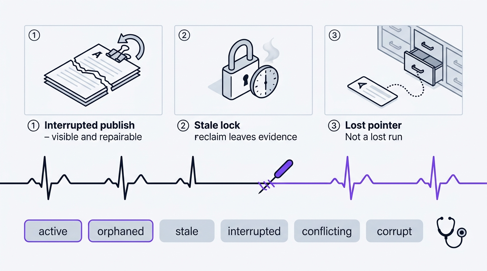

<p align="center">
  
</p>

<h1 align="center">Supreme Team</h1>

<p align="center">
  Design, build, and review software through a coding assistant, with a gate between every phase.
</p>

<p align="center">
  <sub>52 skills · 10 pipelines · one front door · Claude Code, Codex, Cursor, OpenCode</sub>
</p>

---

## What it is

Supreme Team routes a coding request through **design → build → review**, with a
gate between every phase. Each phase has to prove its work, on disk, before the
next one starts. A runtime harness enforces the rules so doctrine is not just
advice.


**How to use it:**

1. **Install** — hand [Install.md](Install.md) to your agent, or run the scripts in [scripts/](scripts/).
2. **Start a run** — call `admiral`. It interviews you, writes the scope down, creates a run on disk, and hands off phase one.
3. **Let it flow** — small reversible edits just get done; security, deploy, and production work always run the full route.

## Review gates

Every phase boundary hits a gatekeeper. The package and its hashed evidence go
through two deterministic validators, then a gatekeeper issues one verdict:
**APPROVED** advances, **REVISE** returns with the exact missing fact (twice, then
escalate), **ESCALATE** comes to you. Change a source file after evidence was
recorded and the gate fails with `input hash drift` instead of trusting a stale log.


More in [docs/gatekeepers.md](docs/gatekeepers.md).

## Persistence & recovery

Run state lives in `skillset-saves/` inside your project. Checkpoints publish
atomically, so an interrupted publish is visible and repairable, a stale lock
reclaim leaves a trace, and a lost pointer is not a lost run. Kill the session
mid-run and the next one resumes from the same files.



More in [docs/persistent-saves.md](docs/persistent-saves.md).

## How well it works

Measured, not asserted. Every skill is scored against a ten-dimension rubric,
every gate boundary is proven satisfiable by submitting a real package to the
real validator, and routing is measured by putting all 52 descriptions in front
of a model and asking which one wins.

| | |
|---|---|
| Skill quality, 52 skills | mean **98.8** / 100, lowest 95 |
| Spec, harness and doctrine | mean **97.5** / 100 |
| Routing accuracy, requests in a user's own words | **94.8%** |
| Automated tests | **359**, all passing |

The routing figure is the one worth reading the methodology for: the same
catalog scores 100% when queried with its own advertised phrasings, and 94.8%
when those queries are rewritten the way someone would actually type them. Only
the second number measures anything.

Full results, per-skill scores, and what is deliberately *not* measured:
[BENCHMARK.md](BENCHMARK.md).

## Check an installation

```bash
python skills/scripts/check_runtime.py
python skills/scripts/validate_manifests.py
python skills/scripts/package_check.py --root .
python skills/harness/hooks/check_readiness.py --host auto
python -m unittest discover -s skills/harness/hooks -p "test_*.py"
python -m unittest discover -s skills/harness/gatekeeper -p "test_*.py"
python -m unittest discover -s skills/validation -p "test_*.py"
```

## Documentation

| Document | What is in it |
|---|---|
| [QUICK-START.md](QUICK-START.md) | Install and first run |
| [Install.md](Install.md) | The full installation procedure |
| [BENCHMARK.md](BENCHMARK.md) | Scores, routing accuracy, and how each was measured |
| [AGENTS.md](AGENTS.md) | Flat skill index for tool discovery |
| [docs/architecture.md](docs/architecture.md) | Pipelines, tiers, execution modes |
| [docs/skills.md](docs/skills.md) | Every skill and what it owns |
| [docs/routing.md](docs/routing.md) | How a request finds its skill |
| [docs/gatekeepers.md](docs/gatekeepers.md) | Boundaries, evidence, verdicts |
| [docs/harness.md](docs/harness.md) | Hooks, readiness, gate validators |
| [docs/persistent-saves.md](docs/persistent-saves.md) | Save layout, locks, resume |
| [docs/direct-invocation.md](docs/direct-invocation.md) | Calling skills directly |
| [docs/directory-structure.md](docs/directory-structure.md) | Where everything lives |

<p align="center">
    <sub>Built by <a href="https://github.com/TykoDev">TykoDev</a> · Supreme Team</sub>
</p>
