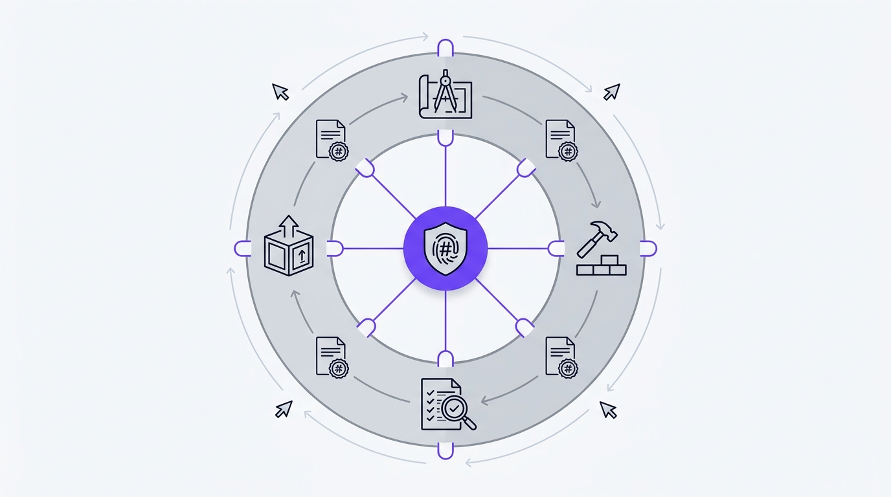

# Architecture

Ten pipelines, one front door.

Each pipeline closes at a gate boundary defined in
[`skills/gates.yaml`](../skills/gates.yaml) and declared in
[`skills/pipelines.yaml`](../skills/pipelines.yaml), which holds the stages, the
stage owners, the closing boundary, and the scripts each stage needs.

Those two files are the truth. This page elaborates them and is not allowed to
contradict them: a contract test checks that every owner is on the roster, every
boundary exists in the gate spec, every named artifact has exactly one writer, and
every required script is actually on disk.



## The ten

| Pipeline | Owner | Closes at | What it is for |
|---|---|---|---|
| `design` | commander | `design-to-build` | Requirements, architecture, interfaces, design system, plan, implementation spec, stack lock |
| `redesign` | redesign | `redesign-review` | Inventory of the current design, taste grilling, four living design-system variants at parity, comparison and decision |
| `build` | build-management | `build-to-review` | Implementation, tests, hardening, runtime health, completeness |
| `review` | code-chief | `review-to-delivery` | Correctness, quality, security, frontend, visual QA, developer experience |
| `security` | cso | `security-review` | Threat model, vulnerability scan, adversarial probe, remediation |
| `investigation` | investigate | `investigation-review` | Reproduction, evidence chain, mechanism, bounded fix path |
| `qa` | qa | `qa-review` | Test matrix, executed probes, defects, scoped fixes |
| `taste` | taste | `taste-review` | Preference confirmation, conflict analysis, persistence, effective-profile handoff |
| `skill-creation` | skill-maker | `skill-maker-to-delivery` | Skill and team drafting, review, packaging |
| `release` | ship | `deploy-readiness` | Readiness, deploy config, rollout, release notes |

The last seven are not side channels. They run inside the same state machine as the
first three, occupying a design-shaped or build-shaped state in their own phase
directory, and meeting a gate at their own boundary.

Production rollout still needs a fresh human decision even after
`deploy-readiness` approves. Approval is not a trigger.

## Admiral

The single front door ([`routing-doctrine.md`](../skills/routing-doctrine.md)).
For anything that is not Tier 0, it:

1. Runs the startup save check, classifies any existing run, and resumes a
   coherent one before starting anything new.
2. Runs the intake interview ([`grill-me-doctrine.md`](../skills/grill-me-doctrine.md))
   and writes the result to `intake/report_grilling.md`. That file is the hashed
   artifact behind the `decisions` gate key.
3. Probes what it can actually do: sub-agent delegation, file I/O, command
   execution. Verifies hook registration, reads the readiness map, checks MCP
   registry freshness.
4. Creates the run through `session-memory` and `save_run.py create` before the
   first delegation, then checkpoints before every later one and at every returned
   boundary.
5. Picks the earliest incomplete boundary and delegates with the same run id,
   revision, artifact mode, execution mode, save path, and session pin.
6. Routes every returned package through its gatekeeper, and rewinds to the
   earliest affected boundary when upstream evidence changes.
7. Assembles only gate-approved packages into the delivery package.

### Tiers

Tier belongs to the run, not the skill
([`execution-contract.md`](../skills/execution-contract.md)). The same skill runs
at Tier 0 for a typo and Tier 3 for an authentication change.

| Tier | Blast radius | Ceremony |
|---|---|---|
| 0 | Local, understood, reversible | Direct change, focused verification, brief note |
| 1 | Bounded and read-only | Intake and evidence, no state change |
| 2 | Multi-step edits, delegation, external coordination | Full route, saved run, gate package |
| 3 | Destructive, security-sensitive, production, irreversible | Tier 2 plus explicit owner intent and a fresh human go decision |

### Modes

| Mode | Trigger | Path |
|---|---|---|
| Full | "run the full pipeline", "ship this end to end" | design, build, review, delivery |
| Partial | "just design", "just review this code" | Only the approved subset asked for |
| Resume | A coherent active or orphaned run is found | Earliest incomplete boundary, after lock and lineage checks |
| Create-skill | "create a skill" | Intake, skill-maker, delivery |
| Create-team | "create a team", "build me a pipeline" | Intake, skill-maker team mode, delivery |

Admiral notices what already exists. A supplied design package skips to build; an
existing codebase skips to review. A skip is honored only when the upstream
artifact is fully approved, structurally complete, and valid for the next
boundary.

### Execution modes

**Agent mode** uses `skills/admiral/agent/agent-manifest.yaml`,
`agent-protocol.md`, and the adapters in `agent/adapters/` to manage state
programmatically and delegate sub-agents with live tool access.

**Skill mode** keeps the same stage sequencing, gate routing, and rewind rules,
but expresses them as instructions the host carries out itself.

The detected mode is recorded in run state and re-probed before every boundary and
on every resume, so a resume never mixes autonomous and instruction-only behavior
halfway through.

## Design

Owner: [`commander`](../skills/design/commander/SKILL.md)

```text
commander -> researcher -> architect -> [security-builder seed] -> planner
          -> engineer -> stack lock -> gatekeeper-design -> design-to-build
```

`architect` owns the frontend and UI design system for user-facing surfaces
([`design-doctrine.md`](../skills/design-doctrine.md)): the component template,
the UI/UX handoff, responsive behavior across six tiers, accessibility.

The stack lock names the registry slug, locked versions, and overlay digest from
[`tech-stacks/registry.yaml`](../skills/tech-stacks/registry.yaml), or the
sanctioned fallback when no runtime or framework changes. Detect the slug with
`python skills/scripts/check_runtime.py --detect-project`.

Out: an approved design package with requirements, architecture, interface
contracts, design system, plan, implementation spec, and traceability.

## Redesign

Owner: [`redesign`](../skills/design/redesign/SKILL.md)

```text
redesign -> design-mapper (inventory, baseline) -> taste (taste grilling, confirmation)
         -> architect (four directions) -> prototyper x4 (living variants)
         -> design-mapper (parity) -> design-qa (render) -> frontier (accessibility)
         -> comparison and decision -> gatekeeper-design -> redesign-review
```

The inventory is the parity contract: every route, state, component,
interaction, and flow gets a stable id, and `check_parity.py` proves each
prototype carries all of them. `variant_set` is validated mechanically for
exactly four variants with hashed files, and `rendered_verification` accepts no
fallback at this boundary because a redesign always has a visible surface.

Out: four living single-page prototypes with component libraries, evidence per
variant, and a recorded decision; the chosen variant enters the design pipeline
as its design-system input. Nothing under a redesign touches application source.

## Build

Owner: [`build-management`](../skills/build/build-management/SKILL.md)

```text
build-management -> bob-the-builder -> test-builder -> [security-builder]
                 -> health-check -> [debugger] [investigate]
                 -> cross-check-build-confirm -> gatekeeper-build -> build-to-review
```

`tests` and `runtime` are typed probe records: the test-runner log and the startup
smoke log, each a hashed file under `build/evidence/`. A count is not evidence.

Out: production code, tests, security evidence, runtime health, completeness
confirmation.

## Review

Owner: [`code-chief`](../skills/review/code-chief/SKILL.md)

```text
code-chief -> bug-review -> code-review -> quality-review -> [security-review]
           -> [mr-robot] -> [frontier] -> [design-qa] -> [devex-review]
           -> finding triage -> gatekeeper-code -> review-to-delivery
```

Bracketed stages are conditional. Security when a trust boundary moved. mr-robot
when there is an exploitable surface. frontier and design-qa when visible behavior
changed. devex-review when a developer-facing surface changed.

`design-qa` produces `rendered_verification`: a typed render record with hashed
captures, the breakpoints and themes covered, and inputs bound to the rendered
source.

Out: adversarially validated findings, executed probes, rendered verification,
residual risk, and a verdict recommendation.

## The pieces underneath

| Subsystem | What it covers | Where |
|---|---|---|
| Entry routing | Front door, tiers, Tier 0, loop guard | [routing.md](routing.md), `skills/routing-doctrine.md` |
| Gate spec | One boundary contract for required, artifact-backed, and typed evidence | [gatekeepers.md](gatekeepers.md), `skills/gates.yaml` |
| Runtime harness | Deterministic hooks and the two gate validators | [harness.md](harness.md), `skills/harness-doctrine.md` |
| Persistent saves | Cross-session resume, locks, journal, audit trail | [persistent-saves.md](persistent-saves.md), `skills/save-protocol.md` |
| Contracts | Evidence standards, handoffs, delivery record, responsibility, states | `skills/contracts/` |
| Ownership | One writer per artifact and per save path | `skills/ownership.yaml`, `skills/save-ownership.yaml` |
| Tech stacks | 14 overlays with pinned versions and digests | `skills/tech-stacks/registry.yaml` |
| MCP registry | Available MCP tools with a freshness TTL checked at intake | `skills/mcp-tools.md` |
| Standalone tools | Browser, release, safety, testing | [direct-invocation.md](direct-invocation.md) |
