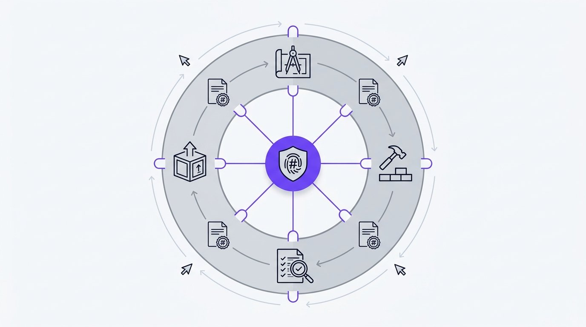

# Architecture

Ten pipelines, one front door. Each pipeline's stages, owners and dependency
graph are in [`skills/pipelines.yaml`](../skills/pipelines.yaml); the boundary it
closes at is in [`skills/gates.yaml`](../skills/gates.yaml). Where this page and
those files differ, the files win.



## The ten

| Pipeline | Owner | Closes at | What it is for |
|---|---|---|---|
| `design` | commander | `design-to-build` | Requirements, architecture, interfaces, design system, plan, implementation spec, stack lock |
| `redesign` | redesign | `redesign-review` | Inventory, taste grilling, four mocks, the user's decision, one living prototype |
| `build` | build-management | `build-to-review` | Implementation, tests, hardening, runtime health, completeness |
| `review` | code-chief | `review-to-delivery` | Correctness, quality, security, frontend, visual QA, developer experience |
| `security` | cso | `security-review` | Threat model, vulnerability scan, adversarial probe, remediation |
| `investigation` | investigate | `investigation-review` | Reproduction, evidence chain, mechanism, bounded fix path |
| `qa` | qa | `qa-review` | Test matrix, executed probes, defects, scoped fixes |
| `taste` | taste | `taste-review` | Preference confirmation, conflict analysis, persistence, effective-profile handoff |
| `skill-creation` | skill-maker | `skill-maker-to-delivery` | Skill and team drafting, review, packaging |
| `release` | ship | `deploy-readiness` | Readiness, deploy config, rollout, release notes |

All ten run inside one state machine
([`workflow-protocol.md`](../skills/contracts/workflow-protocol.md)) and meet a
gate at their own boundary. Production rollout still needs a fresh human decision
after `deploy-readiness` approves.

## Admiral

For anything above Tier 0, `admiral`:

1. Classifies the save directory and resumes a coherent run before starting one.
2. Runs the intake interview ([`grill-me-doctrine.md`](../skills/grill-me-doctrine.md)); the log is the hashed `decisions` artifact.
3. Probes delegation, file I/O and command execution; verifies hook registration; checks MCP registry freshness.
4. Creates the run through `save_run.py` before the first delegation and checkpoints before every later one.
5. Delegates the earliest incomplete boundary with the run id, revision, execution mode, save path and session pin.
6. Routes every returned package through its gate; rewinds to the earliest affected boundary when upstream evidence changes.
7. Assembles only approved packages into the delivery package.

Ceremony scales with the change, not the mode: a bounded change to an existing
codebase runs every stage and gate, sized to the change.

### Tiers

| Tier | Blast radius | Ceremony |
|---|---|---|
| 0 | Local, understood, reversible | Direct change, focused verification, brief note |
| 1 | Bounded and read-only | Intake and evidence, no state change |
| 2 | Multi-step edits, delegation, external coordination | Full route, saved run, gate package |
| 3 | Destructive, security-sensitive, production, irreversible | Tier 2 plus explicit owner intent and a fresh human go decision |

### Modes

| Mode | Trigger | Path |
|---|---|---|
| Full | "run the full pipeline", "ship this end to end" | design, build, review, delivery |
| Partial | "just design", "just review this code" | The earliest incomplete boundary of the requested subset |
| Resume | A coherent active or orphaned run exists | Earliest incomplete boundary after lock and lineage checks |
| Create-skill | "create a skill" | Intake, skill-maker, delivery |
| Create-team | "create a team", "build me a pipeline" | Intake, skill-maker team mode, delivery |

A supplied approved design skips to build; an existing codebase skips to review.
A skip is honored only when the upstream artifact is approved, complete and valid
for the next boundary.

### Execution modes

Agent mode delegates sub-agents with live tool access through
`skills/admiral/agent/`. Skill mode runs the same sequencing as instructions the
host carries out itself. The mode is recorded in run state and re-probed before
every boundary and on resume.

## Scheduling

Stage order in `pipelines.yaml` is a topological order of each stage's
`requires`, not a queue (`scheduling`). Stages whose requires are satisfied are
delegated together: all review lenses on the approved build; the test surface,
security checkpoint and runtime smoke on the implementation; the taste snapshot
and research on the decisions; the security seed and the plan on the
architecture. A pipeline's wall-clock is its longest dependency chain.

## Design

Owner: [`commander`](../skills/design/commander/SKILL.md)

```text
commander -> [taste snapshot | researcher] -> architect -> [security-builder seed | planner]
          -> engineer -> stack lock -> gatekeeper-design -> design-to-build
```

`architect` owns the design system for user-facing surfaces
([`design-doctrine.md`](../skills/design-doctrine.md)). The stack lock names the
registry slug, versions and overlay digest from
[`tech-stacks/registry.yaml`](../skills/tech-stacks/registry.yaml), or the
sanctioned fallback when no runtime or framework changes; detect the slug with
`python skills/scripts/check_runtime.py --project-root . --detect-project`. A lock
on a slug past `support_ends`, or against a registry older than its
`verification_ttl_days`, passes with a warning.

Out: requirements, architecture, interface contracts, design system, plan,
implementation spec, traceability.

## Redesign

Owner: [`redesign`](../skills/design/redesign/SKILL.md)

```text
redesign -> design-mapper (inventory) -> taste (grilling) -> architect (four directions)
         -> prototyper x4 (mocks) -> design-mapper (mock parity) -> design-qa (captures)
         -> the user's selection -> prototyper x1 (living prototype)
         -> design-mapper (full parity) -> design-qa (render) -> frontier (accessibility)
         -> recommendation -> gatekeeper-design -> redesign-review
```

The four drafts are static mocks; one living prototype is built for the chosen
direction. The inventory gives every route, state, component, interaction and
flow a stable id; `check_parity.py --level mock` and `--level full` prove
coverage. Nothing under a redesign touches application source.

## Build

Owner: [`build-management`](../skills/build/build-management/SKILL.md)

```text
build-management -> bob-the-builder -> [test-builder | security-builder | health-check]
                 -> [debugger] [investigate] -> cross-check-build-confirm
                 -> gatekeeper-build -> build-to-review
```

`tests` and `runtime` are typed probe records: the test-runner log and the startup
smoke log, hashed under `build/evidence/`. A count is not evidence.

## Review

Owner: [`code-chief`](../skills/review/code-chief/SKILL.md)

```text
code-chief -> bug-review | code-review | quality-review
           | [security-review] [mr-robot] [frontier] [design-qa] [devex-review]
           -> finding triage -> gatekeeper-code -> review-to-delivery
```

Bracketed lenses are conditional: security-review when a trust boundary moved,
mr-robot when there is an exploitable surface, frontier and design-qa when visible
behavior or surface changed, devex-review when a developer-facing surface changed.
`design-qa` produces `rendered_verification`.

## Underneath

| Subsystem | Where |
|---|---|
| Entry routing, tiers, loop guard | [routing.md](routing.md), `skills/routing-doctrine.md` |
| Gate spec and verdicts | [gatekeepers.md](gatekeepers.md), `skills/gates.yaml` |
| Hooks and validators | [harness.md](harness.md), `skills/harness-doctrine.md` |
| Saves, locks, resume | [persistent-saves.md](persistent-saves.md), `skills/save-protocol.md` |
| Contracts | `skills/contracts/` |
| Ownership | `skills/ownership.yaml`, `skills/save-ownership.yaml` |
| Tech stacks | `skills/tech-stacks/registry.yaml` |
| MCP registry | `skills/mcp-tools.md` |
| Standalone tools | [direct-invocation.md](direct-invocation.md) |
