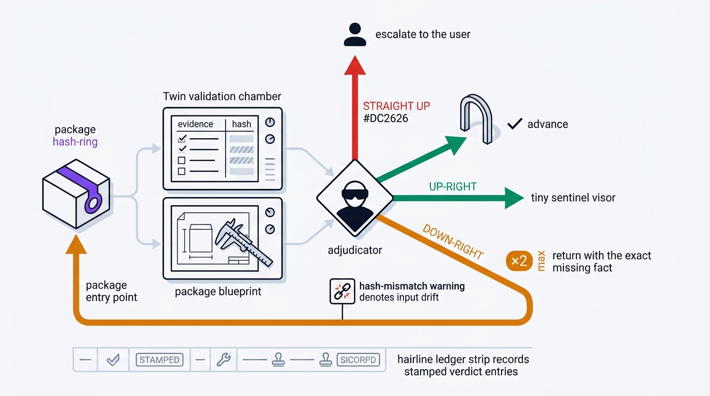

# Gates

Four gatekeepers stand between the phases, and none of them takes your word for
anything. Approval is earned.

| Gatekeeper | Sits at | Argues about |
|---|---|---|
| `gatekeeper-design` | design phase exit | Design specs, architecture decisions, design-system coherence, requirement completeness |
| `gatekeeper-build` | build phase exit | Production code, test quality, hardening evidence, completeness claims |
| `gatekeeper-code` | review phase exit | Review accuracy, finding evidence, severity calibration |
| `gatekeeper-admiral` | every crossing between phases | Handoff completeness, revision lineage, cross-stage alignment |

A fifth, `skill-reviewer`, guards the skill-maker pipeline. It scores a skill 0 to
100 across ten dimensions and hands back a prioritized fix list. It does not apply
fixes. Admiral maps its verdicts onto the standard three: `SHIP` to APPROVED,
`ITERATE` to REVISE, `BLOCKED` to ESCALATE.

## One spec, not four opinions

[`skills/gates.yaml`](../skills/gates.yaml) is the single source of truth for
every boundary: which evidence keys are required, which must be backed by a hashed
artifact, which fallbacks are sanctioned, how typed records are shaped, what the
finding policy is, and the one skill allowed to submit.

`skills/harness/gatekeeper/check.py` loads it. A missing or malformed spec is an
engine error, never a pass.

The table below mirrors that file. A drift test in
`skills/harness/gatekeeper/test_gate_manifests.py` fails if the two ever disagree,
so this table cannot quietly rot.

| Boundary | Guards | Submitter | Required evidence |
| --- | --- | --- | --- |
| `design-to-build` | DESIGN to BUILD | commander | `decisions` `architecture` `interfaces` `plan` `acceptance` `security_seed` `stack_lock` `ui_evidence` |
| `build-to-review` | BUILD to REVIEW | build-management | `approved_design_revision` `implementation` `tests` `runtime` `traceability` `security_evidence` |
| `review-to-delivery` | REVIEW to GATE to COMPLETE | code-chief | `review_verdict` `findings` `executed_probes` `rendered_verification` `residual_risk` `revision_lineage` |
| `security-review` | security pipeline to GATE to COMPLETE | cso | `scope` `threat_model` `findings` `vulnerability_scan` `denial_path_evidence` `remediation_plan` `residual_risk` |
| `investigation-review` | investigation to the owning phase | investigate | `scope` `reproduction` `mechanism` `evidence_chain` `fix_path` `residual_uncertainty` |
| `qa-review` | testing pipeline to GATE to COMPLETE | qa | `scope` `test_matrix` `executed_probes` `defects` `fixes_applied` `residual_risk` |
| `skill-maker-to-delivery` | skill-maker pipeline to GATE to COMPLETE | skill-maker | `skills` `team_manifest` `link_report` `validation_report` |
| `deploy-readiness` | GATE to RELEASE | ship | `approved_delivery` `deploy_config` `verification_plan` `rollback_plan` `human_go_required` |

## Evidence that has to be a file

Some keys cannot be satisfied by saying so. Their value has to point at a path in
the package's `artifact_hashes` map, which means the evidence is a real file with
a real digest:

`decisions`, `architecture`, `plan`, `tests`, `runtime`, `executed_probes`,
`rendered_verification`, `threat_model`, `denial_path_evidence`, `reproduction`,
`evidence_chain`, `test_matrix`, `link_report`, `validation_report`,
`deploy_config`, `verification_plan`, `rollback_plan`.

Eight keys may instead carry a typed applicability record naming `reason`,
`scope`, and `decided_by`, and only for the exact reasons listed under
`fallback_values`: `security_evidence`, `stack_lock`, `ui_evidence`,
`rendered_verification`, `denial_path_evidence`, `vulnerability_scan`,
`fixes_applied`, `team_manifest`. Any other bare string is rejected.

## Typed evidence records

At manifest schema 2, keys listed in `evidence_types` have to be structured
records rather than prose.

| Type | Keys | Must carry |
|---|---|---|
| `probe` | `tests`, `runtime`, `executed_probes`, `reproduction`, `evidence_chain`, `test_matrix`, `denial_path_evidence` | Hashed artifacts and `result.status: pass`. The executed log is the artifact. A bare count is not evidence. |
| `scan` | `vulnerability_scan` | Hashed artifacts, tool, command, exit code, `observed_at`, `inputs` bound by sha256, and a passing status. `unavailable` or `error` is a data gap, never a clean scan. |
| `render` | `rendered_verification` | Hashed captures, the breakpoints and themes covered, `inputs` bound to the rendered source, and pass or `inferred` with a stated limitation. |
| `findings` | `findings`, `security_evidence`, `defects` | Items with id, severity, status. Critical must be verified or not-applicable with a reason. Major must be verified, not-applicable with a reason, or deferred with a named owner and reopen trigger. |
| `verdict` | `review_verdict` | APPROVED, or REVISE/ESCALATE with a challenge record naming `by` and `reason`. |
| `stack_lock` | `stack_lock` | Registry slug, versions, and overlay sha256, checked against `skills/tech-stacks/registry.yaml`. |
| `revision_ref` | `approved_design_revision`, `approved_delivery` | A non-empty approved upstream revision identifier. |

`inputs` is the part that stops evidence going stale. It binds a record to the
project source it describes, so when that source changes the evidence fails as
`input hash drift` instead of quietly continuing to look valid.

## The two validators

| Validator | Input | Question it answers |
|---|---|---|
| `skills/harness/gatekeeper/check.py` | a gate manifest | Does this submission carry the evidence the boundary requires, hashed and bound? |
| `skills/harness/gatekeeper/_gatecheck.py`, via each `gatekeeper-*/scripts/check.py` | a phase package directory | Are the deliverables present, lineage-consistent, and free of blocked phrases? |

Both report facts. Neither issues a verdict. The gatekeeper combines their output
with judgment:

| The validator settles | The gatekeeper decides |
|---|---|
| Required evidence present and artifact-backed | Whether a present artifact is actually adequate |
| Single-revision lineage, one submission id, correct submitter | Whether a contradiction across artifacts is real |
| Artifact existence, SHA-256 hashes, input binding | Whether a scope change warrants ESCALATE |
| Blocked phrases and broken local links | Whether the prose overclaims completion |
| Idempotency drift against a prior verdict | Whether a waiver reason is honest |

Hooks fail open. Gate validators do the opposite and fail loud: a gate that cannot
prove a package is clean must never approve it. Internal error is exit 2, package
defect is exit 1.

## Verdicts

| Verdict | What happens |
|---|---|
| APPROVED | Advance to the next phase or stage |
| REVISE | Back to the owning sub-orchestrator with the exact missing fact and the earliest rewind boundary |
| ESCALATE | Comes to you for a decision |

Two revision cycles per boundary. After that the boundary is marked disputed and
escalated with both positions written down. Remediation always goes back to the
owner. Gatekeepers never edit a package themselves.

Every verdict record carries `verdict_id`, `package_fingerprint`, and
`gate_spec_digest`. It is reusable only when `check.py --prior` reports
`prior_reusable: true`, which needs the same boundary, submission, revision,
fingerprint, and gate spec.

## The posture

Every gatekeeper looks for gaps, contradictions, and unsupported claims. It
demands evidence-backed answers to its challenges, reports findings with the same
four severities (Critical, Major, Minor, Info), enforces the revision cap, writes
every verdict into the audit trail, and rejects packages that add a cross-cutting
constraint without naming its lifecycle layer, or put one later than where it can
actually be enforced ([`harness-doctrine.md`](../skills/harness-doctrine.md) §5).

A review that finds nothing is the most suspicious review of all.

Validator usage and the regression suites:
[`skills/harness/gatekeeper/README.md`](../skills/harness/gatekeeper/README.md).
