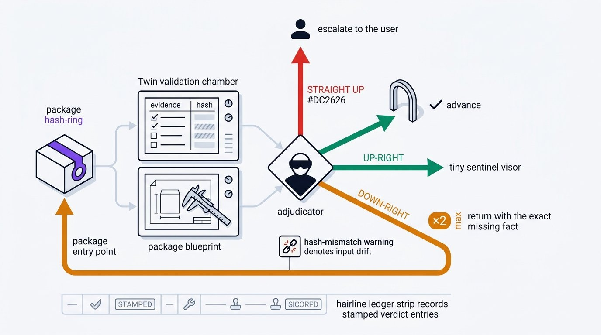

# Gates

Four gatekeepers. Approval is earned against evidence on disk, never asserted.

| Gatekeeper | Sits at | Judges |
|---|---|---|
| `gatekeeper-design` | design phase exit | Design specs, architecture decisions, design-system coherence, requirement completeness |
| `gatekeeper-build` | build phase exit | Production code, test quality, hardening evidence, completeness claims |
| `gatekeeper-code` | review phase exit | Review accuracy, finding evidence, severity calibration |
| `gatekeeper-admiral` | every boundary | The crossing: lineage, boundary-to-package match, blocked phrases, the next consumer's contract |

`skill-reviewer` guards the skill-maker pipeline with a 0 to 100 score; `admiral`
maps `SHIP`, `ITERATE` and `BLOCKED` to APPROVED, REVISE and ESCALATE.

## One spec

[`skills/gates.yaml`](../skills/gates.yaml) defines every boundary: required
keys, artifact-backed keys, sanctioned fallbacks, typed records, finding and
revise policy, and the one submitter. `skills/harness/gatekeeper/check.py` loads
it; a missing or malformed spec is an engine error, never a pass. The table
mirrors the file and is drift-tested against it.

| Boundary | Guards | Submitter | Required evidence |
| --- | --- | --- | --- |
| `design-to-build` | DESIGN to BUILD | commander | `decisions` `architecture` `interfaces` `plan` `acceptance` `security_seed` `stack_lock` `taste_snapshot` `ui_evidence` |
| `redesign-review` | REDESIGN (design-shaped) to GATE to DESIGN or COMPLETE | redesign | `design_inventory` `taste_grilling` `taste_snapshot` `design_directions` `mock_set` `mock_parity` `mock_rendering` `selection` `selected_variant` `parity_evidence` `rendered_verification` `accessibility_evidence` `recommendation` `residual_risk` |
| `build-to-review` | BUILD to REVIEW | build-management | `approved_design_revision` `implementation` `tests` `runtime` `traceability` `security_evidence` |
| `review-to-delivery` | REVIEW to GATE to COMPLETE | code-chief | `review_verdict` `findings` `executed_probes` `rendered_verification` `residual_risk` `revision_lineage` |
| `security-review` | security pipeline to GATE to COMPLETE | cso | `scope` `threat_model` `findings` `vulnerability_scan` `denial_path_evidence` `remediation_plan` `residual_risk` |
| `investigation-review` | investigation to the owning phase | investigate | `scope` `reproduction` `mechanism` `evidence_chain` `fix_path` `residual_uncertainty` |
| `qa-review` | testing pipeline to GATE to COMPLETE | qa | `scope` `test_matrix` `executed_probes` `defects` `fixes_applied` `residual_risk` |
| `taste-review` | TASTE to GATE to COMPLETE or consuming pipeline | taste | `scope` `intent` `before_revision` `preference_diff` `confirmation` `conflict_analysis` `policy_check` `persistence_result` `effective_profile` `consumer_handoff` `taste_review_record` `residual_uncertainty` |
| `skill-maker-to-delivery` | skill-maker pipeline to GATE to COMPLETE | skill-maker | `skills` `team_manifest` `link_report` `validation_report` |
| `deploy-readiness` | GATE to RELEASE | ship | `approved_delivery` `deploy_config` `verification_plan` `rollback_plan` `human_go_required` |

## Evidence that has to be a file

An artifact-backed key names a path in the package's `artifact_hashes` map:
`decisions`, `architecture`, `plan`, `taste_snapshot`, `design_inventory`,
`taste_grilling`, `design_directions`, `mock_set`, `mock_parity`,
`mock_rendering`, `selection`, `selected_variant`, `parity_evidence`, `tests`,
`runtime`, `executed_probes`, `rendered_verification`, `threat_model`,
`denial_path_evidence`, `reproduction`, `evidence_chain`, `test_matrix`,
`link_report`, `validation_report`, `deploy_config`, `verification_plan`,
`rollback_plan`, `preference_diff`, `confirmation`, `conflict_analysis`,
`persistence_result`, `effective_profile`, `taste_review_record`.

Waivable keys carry a typed applicability record (`applicable: false`, `reason`,
`scope`, `decided_by`) whose reason is one of the exact wordings in
`fallback_values`: `security_evidence`, `stack_lock`, `taste_snapshot`,
`ui_evidence`, `rendered_verification`, `denial_path_evidence`,
`vulnerability_scan`, `fixes_applied`, `team_manifest`; at `taste-review` also
`before_revision`, `consumer_handoff`, `residual_uncertainty`; at
`redesign-review`, `selected_variant`, `parity_evidence`, `rendered_verification`
and `accessibility_evidence` stand down together on the wording for a `merge` or
`deferred` selection, and `mock_rendering` has no fallback. Any other string, or
any other wording, fails. `confirmation` has no fallback. Hashes fold text line
endings to LF; `python skills/scripts/content_hash.py <path>` prints one.

## Typed evidence records

A manifest inside a run declares schema 2 and is checked as schema 2 either way.
The one place schema 1 still passes is a flat package outside a run: exit 0 there
means the keys are present and the hashes hold, and the result warns that no typed
record, waiver wording or finding policy was checked; a gatekeeper returns REVISE
for a schema-2 manifest instead of approving it.

| Type | Keys | Must carry |
|---|---|---|
| `probe` | `tests`, `runtime`, `executed_probes`, `reproduction`, `evidence_chain`, `test_matrix`, `denial_path_evidence`, `mock_parity`, `parity_evidence` | Hashed artifacts and `result.status: pass`; the executed log is the artifact. `inputs` optional, re-hashed when present, listed in `warnings` when absent |
| `scan` | `vulnerability_scan` | Hashed artifacts, tool, command, exit code, `observed_at`, `inputs` bound by sha256, passing status. `unavailable` or `error` is a data gap |
| `render` | `rendered_verification`, `mock_rendering` | Hashed captures, breakpoints and themes, `inputs` bound to the rendered source, pass or `inferred` with a stated limitation |
| `findings` | `findings`, `security_evidence`, `defects`, `accessibility_evidence` | Items with id, severity, status. Critical verified or not-applicable with a reason; Major verified, not-applicable, or deferred with owner and reopen trigger |
| `verdict` | `review_verdict` | APPROVED, or REVISE/ESCALATE with a challenge record naming `by` and `reason` |
| `stack_lock` | `stack_lock` | Registry slug, versions, overlay sha256, checked against the registry and the overlay file |
| `revision_ref` | `approved_design_revision`, `approved_delivery` | A non-empty approved upstream revision |
| `security_seed` | `security_seed` | `applicable`, `scope`, `decided_by`, `architecture_revision`, `reason`, `boundaries` with id and control |
| `human_go` | `human_go_required` | `decision: go`, approver, approval reference, ISO timestamp, revision equal to `approved_delivery` |
| `preference_diff`, `confirmation`, `conflict_analysis`, `persistence_result`, `effective_profile`, `consumer_handoff` | the Taste keys | The record shapes in [`taste-doctrine.md`](../skills/taste-doctrine.md) |
| `variant_set` | `mock_set`, `selected_variant` | Exactly four mocks or exactly one variant, each with hashed files |
| `selection` | `selection` | Hashed report, `decision` of `variant`, `merge` or `deferred`, `chosen` and `recommended` ids, `decided_by`, `decided_at`, `basis` |

`inputs` binds a record to the source it describes; a changed source fails as
`input hash drift`.

| The gate verifies | The gate takes on trust |
|---|---|
| Every named artifact exists and matches its sha256 | That the artifact is what the record says |
| Every `inputs` entry still hashes as recorded | That a probe binds any source at all |
| `result.status` is a passing value with no non-zero `exit_code` beside it | That `tool`, `command`, `observed_at` and `exit_code` are true; nothing is re-run |
| Each record has its type's shape | Who wrote it; `decided_by`, `actor` and `by` are free text |

## The two validators

| Validator | Input | Settles |
|---|---|---|
| `skills/harness/gatekeeper/check.py` | a gate manifest | Required keys present and artifact-backed, typed records shaped, hashes and inputs bound, one revision, the right submitter, blocked phrases and broken links, drift against `--prior` |
| `gatekeeper-*/scripts/check.py` (`_gatecheck.py`) | a phase package directory | Deliverables present with their marker fields, single-revision lineage, skip records, blocked phrases, links that stay inside the package |

Both report facts and fail loud: package defect exit 1, engine error exit 2,
never a pass. The gatekeeper adds judgment: whether an artifact is adequate,
whether a contradiction is real, whether a waiver reason is honest, whether a
scope change warrants ESCALATE.

## Verdicts

| Verdict | What happens |
|---|---|
| APPROVED | Advance; Minor and Info findings ride along for the next owner |
| REVISE | Back to the owner with every finding at once, grouped by owner; only for a mechanical failure, a Critical, or an unresolved Major |
| ESCALATE | Comes to you |

Two REVISE rounds per boundary, then the dispute is escalated with both
positions. Gatekeepers never edit a package.

A verdict record carries `verdict_id`, `package_fingerprint` and
`gate_spec_digest`: sha256 of public inputs, not signatures. It is reusable only
when `check.py --prior` reports `prior_reusable: true`. At delivery, re-run
`check.py` without `--gates`, `--registry` or `--prior` and read
`gate_spec_is_shipped: true` from the fresh result.

## Revise policy

`gates.yaml` `revise_policy`:

| Rule | Meaning |
|---|---|
| `self_check` | The submitter runs both validators before submitting; a package that fails the machine is never submitted |
| `one_packet` | A REVISE carries every mechanical failure and judgment finding, grouped by owner in `revise_packet.by_owner` |
| `parallel_fix` | The lead delegates every owner group at once and resubmits once |
| `delta_review` | On `--prior`, the gate re-judges `changed_evidence` and carries its judgment on `unchanged_evidence` |
| `revise_threshold` | REVISE only for a mechanical failure, a Critical, or an unresolved Major; Minor and Info never cause one |
| `batch_fix` | One revision per owner; a resubmission gets new findings only on changed evidence or a defect the change introduced |
| `rerun_scope` | The lead re-runs only the stages the packet names or that depend on changed evidence; a key it authors itself is fixed in place |
| `cross_stage_scope` | `gatekeeper-admiral` judges the crossing and carries the phase gate's adequacy judgment unless evidence changed or the phase verdict was not APPROVED; at the six boundaries with no phase gatekeeper it judges every key |
| `cycle_cap` | Two rounds, then escalate |

The phase verdict (`verdict_<boundary>.json`) and the cross-stage verdict
(`verdict_<boundary>.cross-stage.json`) sit side by side; the second reads the
first through `--prior` and never overwrites it.

## Posture

Every gatekeeper demands evidence for every claim, grades findings Critical,
Major, Minor or Info, enforces the cycle cap, writes its verdict to the audit
trail, and rejects a cross-cutting constraint that names no lifecycle layer
([`harness-doctrine.md`](../skills/harness-doctrine.md) §5). A package that
passed both validators with only Minor or Info findings is approved with them
attached.

Validator usage: [`skills/harness/gatekeeper/README.md`](../skills/harness/gatekeeper/README.md).
