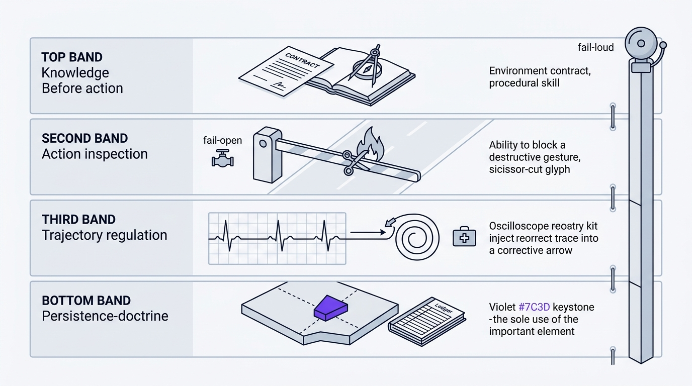

# Runtime Harness

The harness adapts the interface between the model and its environment. Not the
model. The interface.

It exists because doctrine written in prose is a suggestion. A hook that refuses
to let a write land is not. Where the host supports interception, the harness
turns a rule into a mechanism. Where it does not, the rule stays advisory and says
so rather than pretending.

Specified in [`skills/harness-doctrine.md`](../skills/harness-doctrine.md).



## The rule that governs the other rules

Supreme Team runs on whatever model the host gives it. So every intervention has
to rescue a weak backbone without getting in a strong one's way. An intervention
that helps a small model but interferes with a competent model doing the right
thing is a defect, not a feature.

When in doubt, the intervention does nothing.

## Four layers

Every cross-cutting constraint belongs to exactly one of these, and to the
earliest one where it can actually be enforced.

| # | Layer | When it acts | What it does | Where it lives |
|---|---|---|---|---|
| 1 | Environment Contract | before interaction | Makes tool, policy, and format constraints explicit | `design-doctrine.md`, `grill-me-doctrine.md`, `mcp-tools.md`, `tech-stacks/registry.yaml`, intake briefs |
| 2 | Procedural Skill | task conditioning | Surfaces a compact reusable procedure before work starts | the skill library, `session-memory` learnings, `pipelines.yaml` |
| 3 | Action Realization | before execution | Validates, canonicalizes, or blocks a generated action | `careful`, `freeze`, `guard`, `unfreeze`, the save write probe, `pre_tool_use.py` |
| 4 | Trajectory Regulation | after execution | Catches loops, stagnation, and empty-output streaks; injects recovery | gatekeepers, checkpoints, rewind rules, `post_tool_use.py` |

Skills are instructions running inside the host's loop. They do not own that loop.
The only deterministic place to intercept is a host hook, so layers 3 and 4 have
two expressions: advisory prose in the skills, and where the host allows it, real
enforcement under `skills/harness/hooks/`.

## The hooks

Stdlib only. Fail open, meaning any internal error exits 0 and your action
proceeds. Inert on the strong case, meaning each rule fires only on a
mechanically certain signal.

| File | Event | Layer | What it does |
|---|---|---|---|
| `pre_tool_use.py` | `PreToolUse` | 3 | Blocks dangerous shell commands, writes into a frozen or guarded boundary, and direct edit-tool writes to core run files; advises (never denies) when a coverage command names no destination |
| `post_tool_use.py` | `PostToolUse` | 4 | Records repeated failures, empty-output streaks, and oscillation; refreshes the pinned run's heartbeat from real activity; sweeps project-root coverage residue into the run |
| `user_prompt_submit.py` | `UserPromptSubmit` | routing | Points lifecycle work at `admiral`, reinforces the session pin, stays quiet on slash commands |
| `save_run.py` | CLI | persistence | The only writer of the run record |
| `verify_registration.py` | diagnostic | | Inspects host hook config without touching it. Exit 0 registered, 1 missing, 2 unknown |
| `repair_registration.py` | diagnostic | | Previews a scoped registration repair; writes only with `--apply` |
| `check_readiness.py` | diagnostic | | Reports Python, hooks, and saves as a capability map |

## Readiness is a map, not a verdict

```bash
python skills/harness/hooks/check_readiness.py --host auto
python skills/harness/hooks/check_readiness.py --host auto --require-active-run
```

Each capability is reported on its own: `python_runtime`, `hooks_configured`,
`hooks_executable`, `hooks_observed`, `saves_readable`, `active_run`,
`deterministic_validators`. Missing hooks cost you deterministic enforcement and
nothing else; save reading and the validators keep working.

`hooks_observed` stays `unverified` until a hook actually fires. Reading config
proves registration, never execution, and the diagnostic refuses to blur the two.

Use `--require-active-run` on a resume. A fresh intake has no run yet, so
demanding one there always reports not ready.

The diagnostic is report-only. It will not install Python, register hooks, or
create save state. Admiral never blocks a run on a failed check either: it warns,
records the result, and notes that routing is advisory until the prompt-submit
hook is registered.

## Registration

Opt-in, always: `-RegisterHooks` on Windows, `--register-hooks` on macOS and
Linux.

Codex, Claude Code, and Copilot take native JSON hook config, which means
`verify_registration.py` can read it back and confirm the command is genuinely
executable. Cursor and OpenCode load a plugin package instead, so the installer
writes it but reports it as not machine-verifiable rather than claiming a state it
cannot check.

When a hook is missing, `verify_registration.py` emits a `REGISTER_PROMPT` and
Admiral offers the preview:

```bash
python skills/harness/hooks/repair_registration.py --host claude --scope project
python skills/harness/hooks/repair_registration.py --host claude --scope project --apply
```

Preview is the default. `--apply` needs your approval, and global host config is
never touched silently.

`scripts/install_hooks.py` and `repair_registration.py` share one definition of
the hook set, the matchers, and the command format, so a first install and a later
repair cannot disagree about what should be registered.

## Guard and freeze

`pre_tool_use.py` enforces the boundary that `guard` and `freeze` record in
`.harness-state/guard-state.json`: `frozen_globs`, `blocked_globs`, and
`allow_dangerous`.

The state helper resolves that path under `SUPREMETEAM_PROJECT_DIR` first, then a
known host workspace variable, then the nearest ancestor of the working
directory that holds `skillset-saves/`, `.harness-state/`, or `.git`, then the
working directory, then an isolated temp fallback. Every generated file lands
under `skillset-saves/` or `.harness-state/` (`save-ownership.yaml`
`generated_roots`). With the file absent or empty, only the built-in destructive-pattern
guard applies. `unfreeze` clears `frozen_globs`.

## Coverage residue

Coverage data belongs in the run at `<phase>/evidence/coverage/`
(`scripts/output_paths.py --kind coverage`), not at the project root. Point
`COVERAGE_FILE`, `--data-file`, `--cov-report`, `--coverage.reportsDirectory`, or
`--report-dir` plus `--temp-dir` there before the runner starts, and never use
parallel or per-process mode without a `coverage combine` into that destination:
one observed run wrote a `.coverage` tree of over three thousand files in under
two minutes that way.

Two hooks back that rule up. `pre_tool_use.py` emits advisory context — never a
deny — for a shell command that writes coverage with no destination named
(`coverage run -p` without a combine, `pytest --cov` with no `--cov-report`,
`nyc`/`c8` with no `--report-dir`/`--temp-dir`, `vitest --coverage` with no
`reportsDirectory`). After a command action, `post_tool_use.py` sweeps
`.coverage`, `.coverage.*`, `.coverage/`, `htmlcov/`, and `.nyc_output/` from the
project root into the active run's `evidence/coverage/`, or into
`.harness-state/test-work/coverage-residue/<timestamp>/` when no run is active.
The sweep keeps the relative structure, combines relocated `.coverage.*`
fragments where the `coverage` module is importable (with `--keep`, so the
originals survive), skips anything inside a frozen or blocked glob, never touches
`skillset-saves/` or `.harness-state/` themselves, is bounded to 5000 project-root
entries per call, and deletes nothing. It reports what moved and where as
additional context. A sweep that had to run means the step never named its
destination.

## Gate validation

Two validators run at a boundary. `check.py` loads
[`skills/gates.yaml`](../skills/gates.yaml) and validates a manifest's evidence
contract. `_gatecheck.py`, behind each `gatekeeper-*/scripts/check.py`, validates
the shape of the phase package. Both report facts, never a verdict.

Where the hooks fail open, these fail loud. A gate that cannot prove a package is
clean must never approve it. Internal error is exit 2, package defect is exit 1.
See [gatekeepers.md](gatekeepers.md).

## Classifying a failure

Take the earliest category that matches, so a downstream symptom never masks the
root interface failure.

1. **Action-realization failure.** Reasonable intent, not submitted in executable
   form: a plain-text "tool call", invalid arguments. Layer 3.
2. **Environment-contract mismatch.** Executable, but violates tool bounds,
   ordering, or argument semantics. Layer 1.
3. **Trajectory degeneration.** Valid actions, but the episode loops, stalls, or
   burns its budget without progress. Layer 4.
4. **Residual reasoning failure.** The protocol was followed and the logic is
   simply wrong. Not the harness's problem.

Categories 1 through 3 are harness-addressable. Routing a category 4 failure to a
harness intervention is itself a doctrine violation.

Worked example: a command exits zero, then a unit test fails because the logic is
wrong. That is category 4. `post_tool_use.py` deliberately stays silent, because a
failing test is a well-formed signal the model can already act on, and correlating
two tool calls by causal inference is exactly the kind of guessing the harness is
not allowed to do.

## Non-negotiables

Every intervention is local and minimal, evidence-triggered, never overrides
ambiguous reasoning, uses no oracle or hidden labels, ships with a regression
check, and fails open.

## Tests

```bash
python -m unittest discover -s skills/harness/hooks -p "test_*.py"
python -m unittest discover -s skills/harness/gatekeeper -p "test_*.py"
python -m unittest discover -s skills/validation -p "test_*.py"
python skills/scripts/validate_manifests.py
python skills/scripts/check_runtime.py
python skills/scripts/package_check.py --root .
```
