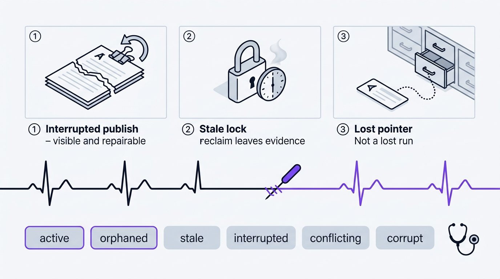

# Persistent Saves

Everything the pipeline produces goes to disk while it runs: run state,
deliverables, evidence, verdicts. So the next session resumes from evidence rather
than from memory, which is the only kind of resume that survives a crash.

Full contract in [`skills/save-protocol.md`](../skills/save-protocol.md).



## Layout

Saves live in `skillset-saves/` inside the project you are working on, never in
the Supreme Team source tree.

```text
skillset-saves/
  _latest.md                       # pointer: run_id, revision, updated_at
  _write.lock                      # writer mutex, locked by the OS while save_run.py writes
  runs/{run-id}/
    _state.md                      # run state
    _lock.md                       # lock with heartbeat
    _audit-trail.md                # append-only events
    _journal.json                  # exists only mid-publish
    _history/                      # rev-<n>.state.json / rev-<n>.lock.json
    intake/report_grilling.md      # the hashed decisions artifact
    design/                        # one directory per phase
      manifest.json                #   the gate submission
      reports/                     #   reports, plans, summaries
      artifacts/                   #   tokens, components, snapshots
      evidence/                    #   command logs, scans, captures
        coverage/                  #     coverage data files and reports
      packages/                    #   exported archives
      verdict_design-to-build.json #   the phase gatekeeper's durable verdict
      verdict_design-to-build.cross-stage.json  # gatekeeper-admiral's, beside it
    build/  review/  security/  investigation/  qa/  taste/  redesign/  skill-creation/  release/
    delivery/reports/              # admiral's handoff_<boundary>.md and delivery-package.md
```

Your application source keeps its own layout. Evidence that depends on it binds by
`path` plus `sha256`, so a changed source file fails the gate as `input hash
drift` instead of silently going stale. Hashes fold CRLF to LF for text and leave
binary untouched, so the same value verifies on either line-ending convention;
`python skills/scripts/content_hash.py <path>` prints it.

## One writer per path

This is the rule that keeps concurrent phases from stepping on each other.

`session-memory` owns the run record and writes it only through
`skills/harness/hooks/save_run.py`. Each phase lead owns its phase directory. A
specialist writes only the artifact its delegation named. Gatekeepers write
verdicts and never touch a submission.

[`save-ownership.yaml`](../skills/save-ownership.yaml) is the path-level policy;
[`ownership.yaml`](../skills/ownership.yaml) is the artifact-level owner map.
`skills/validation/test_save_contracts.py` checks part of their agreement: the
writers of the run record, the gate verdicts and the grilling log, and that the
tools of two classes exist. The other classes are not compared with the owner map.
`pre_tool_use.py` denies edit-tool writes to core run files outright.

## Lifecycle

```bash
python skills/harness/hooks/save_run.py create     --run-id <run> --evidence <path>
python skills/harness/hooks/save_run.py checkpoint --run-id <run> --expect-revision <n> --evidence <path>
python skills/harness/hooks/save_run.py status     --run-id <run>
python skills/harness/hooks/save_run.py complete   --run-id <run>
python skills/harness/hooks/save_run.py recover    --run-id <run> --reason "<why>" [--rollback]
```

`create` needs at least one `--evidence` path, since a run stands on the evidence
it is created from, and a run id of 1 to 128 letters, digits, `.`, `_` or `-` that
starts with a letter, digit or `_`. Only `create` holds an id to that grammar: a run
an earlier writer made under a looser one (any single path segment) is still read,
resumed, recovered and closed by its id. It runs a write, read, and delete probe
before claiming anything, and refuses while another run holds the session pin. Persistence is
active only once it returns `ok`. Resolve the intake report it cites with
`skills/scripts/output_paths.py --kind phase_report --phase intake --name
report_grilling.md`.

Checkpoint before every delegation and at every returned boundary. Each checkpoint
snapshots the previous revision into `_history/`, registers evidence hashes,
refreshes the heartbeat, and publishes state, lock, and pointer atomically behind
`_journal.json`. Evidence that moved or was pruned is dropped with
`--drop-evidence <path> --reason <why>`, which the audit trail records; a run keeps
at least one evidence path, so the last one is dropped only together with its
replacement in `--evidence`.

An interrupted publish shows up as `interrupted` and is repaired with
`recover --rollback`. While the journal exists, every other operation is refused
rather than layering a second partial write on top of the first. The rollback
leaves the lock with a fresh heartbeat, and it also frees the id of a `create` that
died before it finished.

Exit codes matter here. 0 is `ok`. 1 is `refused`, which is a contract violation to
resolve, never something to work around by hand-editing save files; the one
refusal to simply retry is a busy write lock. 2 is `degraded`, meaning the write
failed and nothing coherent was published. 3 is an engine error: the writer could
not run on the input it was given (an unreadable file, an invalid value), nothing
was published, and the JSON report is on stderr rather than stdout. Refused and
degraded operations are recorded in the run's audit trail, so `/audit-improve` can
see them. Read `result` in the JSON on stdout before treating a 2 as degraded: a
mistyped option is argparse's own exit 2 and prints nothing there. The other tools'
codes are in [harness.md](harness.md#exit-codes-and-streams).

## Locks and staleness

A lock records owner, status, session pin, revision, and an ISO-8601 heartbeat.
Active state needs a pinned, held lock. Terminal state needs an unpinned, released
one. A lock goes stale when its heartbeat is more than 30 minutes old, or dated
more than five minutes in the future.

Separate from that lock record, every write holds one mutex, `_write.lock`, from
reading the run to its last write, and re-checks the revision inside it. Two
writers at once therefore take turns instead of losing an update: the second finds
what the first published, and a stale `--expect-revision` is refused. The operating
system releases the mutex when its holder exits, so a killed writer never wedges a
run. A writer that must succeed waits `--lock-timeout` seconds (default 10), then
refuses and asks you to retry.

With hooks registered, all three hooks (`pre_tool_use.py`, `post_tool_use.py`,
`user_prompt_submit.py`) refresh the heartbeat from real host activity, throttled
to once every five minutes, so an attended run does not go stale mid-phase. The
refresh costs a read of the pointer and the pointed run's lock, not a scan of every
saved run; a hook waits a quarter of a second for the mutex and skips the refresh
if another writer has it, because a hook never holds up the host, and that skip is
the design, not a hook fault. It will not revive a lock that is already stale.

Every record the writer creates (state, lock, pointer, journal, history snapshots and
the audit trail) is readable by its owner alone, whatever the umask; directories keep
the default, and `_write.lock` is an empty mutex file.

That makes a project directory shared by two operating-system accounts a place where
the second account cannot see the first one's runs, and it does not take that for an
empty save root. A record that exists and that the account is refused is classified
`corrupt` with `access_denied` naming the file (`skillset-saves/runs/<id>/_lock.md
exists but this account cannot read it (permission denied)`), never as a missing or
malformed one. `create`, resuming a released run and `recover` refuse beside it with
that path and reason; every other operation on that run says the same instead of
"no lock"; the readiness diagnostic prints it under `Saves:` with its next step; and
the hook-file gate and the session-pin reminder count it as a held run, because it
may be one and the second account cannot tell. The way forward is the first account
completing or releasing the run, or the records being made readable to the second.
Nothing changes for an account that can read them.

Reclaiming a stale lock requires `recover --reason`, which writes the stale lock's
path, heartbeat, owner, and sha256 into the audit trail before taking it. Nothing
disappears quietly.

## What startup sees

`save_run.py status` (or the readiness diagnostic) classifies saved state as
active, inactive, complete, stale, orphaned, conflicting, corrupt, interrupted,
missing, uninitialized, or unreadable. `complete` is a finished run; `inactive` is
a released or blocked one, and `run_status` names which. `uninitialized` is a run
directory that holds intake's report and no record yet: run `create`. `status`
also classifies the run you asked about as `requested_run` and says what to do
next; the readiness diagnostic prints the same next step under `Saves:` unless a run
is active. Only a coherent fresh active or orphaned record reinforces the session pin.
`corrupt` with `access_denied` is not damage but a record this account cannot read
(above): it is neither resumed nor overwritten, and the guard treats it as held.

`_latest.md` is a pointer, not the truth. When it is missing, stale, or disagrees
with a reclaimable run, scan `runs/` before concluding there is nothing to resume.

A lost pointer is not a lost run.

## Resume and rewind

On resume, verify the pointer, lock, owner, revision, referenced artifacts,
hashes, and evidence before picking a state. Then continue from the next
incomplete boundary.

When upstream evidence changes, rewind to the earliest affected boundary and
invalidate only the verdicts that actually depend on it. A verdict survives only
when `check.py --prior` reports `prior_reusable: true`.

## Repository hygiene

`skillset-saves/` is local runtime state: locks, audit trails, gate packages, and
resumable deliverables for the current workspace. It is in `.gitignore` and should
stay there.

Keep it to resume or audit a run. Delete it when you actually mean to throw that
history away.

Coverage output is part of that runtime state, not part of your repository.
Anything named `.coverage`, `.coverage.*`, `.coverage/`, `htmlcov/`, or
`.nyc_output/` at the project root is residue a test step left behind; the data
belongs in the run at `evidence/coverage/`, resolved with
`skills/scripts/output_paths.py --kind coverage`. Point `COVERAGE_FILE`,
`--data-file`, `--cov-report`, `--coverage.reportsDirectory`, or `--report-dir`
plus `--temp-dir` there before the runner starts, and never use parallel or
per-process mode without a `coverage combine` into that destination — one
observed run wrote a `.coverage` tree of over three thousand files in under two
minutes that way. After a command action `post_tool_use.py` moves whatever is
left into the run's `evidence/coverage/` (or, with no active run, into
`.harness-state/test-work/coverage-residue/<timestamp>/`), combining the
fragments where it can and deleting nothing. Those names are in `.gitignore` and
should stay there.
