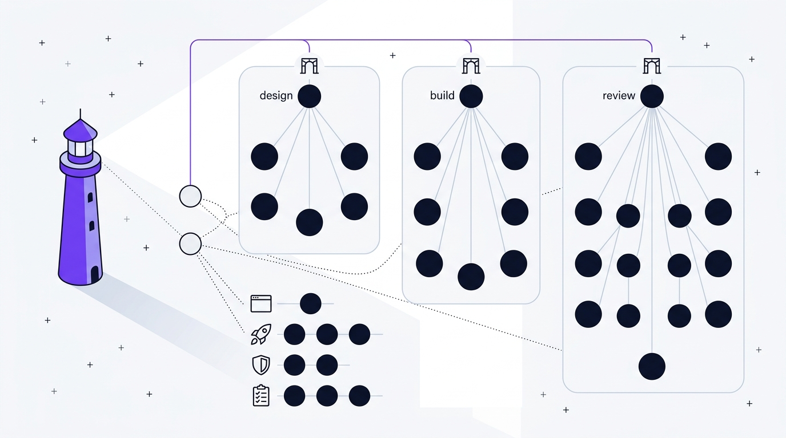

# The Skills

52 of them. Three delivery pipelines, a few cross-cutting components, and four
groups of standalone tools you can call whenever you like.

The roster is declared in
[`skills/team-manifest.yaml`](../skills/team-manifest.yaml) and cross-checked
against every pipeline owner, gate submitter, and artifact writer by
`skills/validation/test_pipeline_contracts.py`. If a skill listed here vanished,
that suite would fail.

For the flat machine-readable index with paths, see [AGENTS.md](../AGENTS.md).

## Admiral layer (2)

| Skill | What it does |
|---|---|
| **admiral** | The front door. Intake, routing, delegation, gate routing, delivery assembly |
| **gatekeeper-admiral** | Argues with every package crossing between phases |

## Design (9)

Turns a vague idea into something you could hand to a builder without answering
forty questions.

| Skill | What it does |
|---|---|
| **commander** | Runs the pipeline, delegates the specialists, locks the stack, owns the gatekeeper-design cycle |
| **researcher** | Requirements and domain analysis, grounded in what is actually in the repo |
| **planner** | Milestones, rollout, decision gates, risk handling |
| **architect** | System architecture, API contracts, and the frontend design system |
| **engineer** | The implementation spec: delivery slices, dependency order, operational constraints |
| **gatekeeper-design** | Design phase-exit validator; also gates `redesign-review` |
| **redesign** | Runs the redesign pipeline: inventory, taste grilling, four living design-system variants, comparison, decision |
| **design-mapper** | Records the current design as a stable-id inventory with baseline captures, then verifies variant parity |
| **prototyper** | Builds one variant: tokens, a framework-free shadcn-shaped component library, and a living single-page prototype |

The UI design system belongs to **architect** per
[`design-doctrine.md`](../skills/design-doctrine.md). There is no separate
`designer` skill. `commander` locks the stack against
[`tech-stacks/registry.yaml`](../skills/tech-stacks/registry.yaml) at the
`design-to-build` boundary.

## Build (8)

Writes the code, and then tries to prove it works.

| Skill | What it does |
|---|---|
| **build-management** | Runs the pipeline, owns the gatekeeper-build cycle |
| **bob-the-builder** | Implements the approved scope. No placeholders, no unowned TODOs |
| **test-builder** | Builds the test surface across the scope and the failure paths that matter |
| **security-builder** | Hardening: unsafe dependencies, insecure patterns, missing controls |
| **cross-check-build-confirm** | Internal completeness check before the package goes anywhere |
| **debugger** | Isolates the root cause of a reproduced build failure and returns a bounded fix |
| **health-check** | Runtime health, startup readiness, environment dependencies |
| **gatekeeper-build** | Build phase-exit validator |

## Review (11)

The biggest group, because this is where most of the value is.

| Skill | What it does |
|---|---|
| **code-chief** | Runs the pipeline, triages findings, recommends the verdict |
| **bug-review** | Correctness defects, broken invariants, crash paths, data corruption |
| **code-review** | Merge readiness, local quality, change risk, clarity of the change as submitted |
| **quality-review** | Maintainability, architecture drift, standards, tech-debt pressure |
| **security-review** | Defensive posture, dependency exposure, access control, data handling |
| **cso** | Security leadership: governance, accepted risk, release posture, control gaps. Also owns the standalone security pipeline |
| **mr-robot** | Adversarial penetration testing: exploit paths, abuse cases, chaining |
| **frontier** | Frontend performance, accessibility, robustness, component behavior |
| **design-qa** | Visual QA: hierarchy, token adherence, responsive behavior, polish |
| **devex-review** | Developer experience: onboarding, tooling, docs clarity, integration friction |
| **gatekeeper-code** | Reviews the reviewers. Validates the consolidated review package |

## Cross-cutting (6)

| Skill | What it does |
|---|---|
| **investigate** | Root-cause analysis across code, logs, runtime clues, and environment when the failure shape is still unclear. Owns the investigation pipeline; its bounded fix path returns to the owning phase rather than becoming a build of its own |
| **skill-maker** | End-to-end creation, review, improvement, and packaging of skills and skill teams |
| **skill-creator** | Drafts and improves skills: authoring, supporting files, evals, trigger tuning, packaging |
| **skill-reviewer** | Adversarial quality gate. Scores 0 to 100 across ten dimensions and returns a prioritized fix list |
| **session-memory** | Cross-session state and durable learnings. Checkpoints and resume |
| **taste** | Preference lifecycle owner and sole semantic writer; resolves global and project profiles and submits the Taste gate |

## Taste (2)

| Skill | What it does |
|---|---|
| **taste** | Owns preference intake, canonical writes, effective-profile resolution, and the Taste gate submission |
| **taste-review** | Read-only review of provenance, conflicts, redaction, confirmation, and persistence safety |

## Standalone tools (15)

Out of routing scope. Call any of these directly, at any time, with or without a
pipeline running.

### Browser automation (4)

| Skill | What it does |
|---|---|
| **browse** | Drives an existing browser session with an evidence-first page-reading workflow |
| **open-browser** | Launches a visible browser workspace, reusing one before installing anything |
| **setup-browser-cookies** | Prepares authenticated session state for protected surfaces |
| **pair-agent** | Pairs a remote collaborator to a browser session with short-lived scoped access |

### Release and deployment (4)

| Skill | What it does |
|---|---|
| **ship** | Release orchestration: readiness, sequencing, verification, follow-up |
| **land-and-deploy** | Merge, rollout, verification, and post-release checks with rollback awareness |
| **setup-deploy** | Durable deployment settings and environment conventions |
| **document-release** | Release notes, operational follow-up, documentation trail |

### Safety guardrails (4)

| Skill | What it does |
|---|---|
| **guard** | Intent checks and write boundaries together |
| **careful** | Confirmation before a destructive or irreversible action |
| **freeze** | Locks a declared path from edits until you lift it |
| **unfreeze** | Clears a protection boundary and records that the area is open |

### Testing and QA (3)

| Skill | What it does |
|---|---|
| **qa** | Tests the product, records evidence, applies scoped fixes, reruns until stable |
| **qa-only** | Read-only testing. An evidence-backed defect report, no fixes |
| **benchmark** | Comparative performance measurement with repeatable evidence |

## What holds it together

Not skills, but load-bearing. See [architecture.md](architecture.md),
[gatekeepers.md](gatekeepers.md), and [harness.md](harness.md).

### Machine-readable specs

| File | Purpose |
|---|---|
| `gates.yaml` | Ten boundaries: required and artifact-backed evidence, fallbacks, typed records, finding policy, submitters |
| `pipelines.yaml` | Ten pipelines: ordered stages, owners, closing boundary, required scripts |
| `ownership.yaml` | One writer per design and handoff artifact |
| `save-ownership.yaml` | One writer per path class under `skillset-saves/` and `.harness-state/` |
| `team-manifest.yaml` | The roster everything else is checked against |
| `runtime-manifest.yaml` | Runtime floor, launchers, supported commands |
| `package-manifest.yaml` | Include, exclude, delivery contract |
| `tech-stacks/registry.yaml` | 14 stack overlays with pinned versions and digests |

### Doctrine and contracts

| File | Purpose |
|---|---|
| `execution-contract.md` | The six preamble clauses and the tier table |
| `routing-doctrine.md` | Entry routing, precedence, Tier 0, session pin |
| `grill-me-doctrine.md` | Intake interview; produces the hashed decisions artifact |
| `design-doctrine.md` | Frontend design system, responsive tiers, accessibility, gate evidence |
| `harness-doctrine.md` | Lifecycle layers, failure taxonomy, non-negotiables |
| `performance-doctrine.md` | Measured optimization, baselines, regression budgets |
| `save-protocol.md` | Save layout, lifecycle, ownership, resume, rewind |
| `mcp-tools.md` | MCP tool registry with a freshness TTL |
| `contracts/evidence-standards.md` | What can support a claim |
| `contracts/handoff-templates.md` | Save Context block, request and response fields, manifest schema 2 |
| `contracts/workflow-protocol.md` | State machine, revision lineage, rewind, resume, failure rules |
| `contracts/responsibility-matrix.md` | One writer per lifecycle layer |
| `contracts/universal-frameworks.md` | Cross-cutting invariants and where they are practiced |
| `contracts/delivery-template.md` | The final delivery record |

### Runtime

| Component | Purpose |
|---|---|
| `harness/hooks/` | Three lifecycle hooks, the `save_run.py` writer, the shared `_saves.py` reader, registration and readiness diagnostics |
| `harness/gatekeeper/check.py` | The boundary validator. Loads `gates.yaml` |
| `harness/gatekeeper/_gatecheck.py` | The package-shape engine behind each `gatekeeper-*/scripts/check.py` |
| `scripts/` | Data formats, output paths, runtime and stack detection, scan records, manifest validation, package check |
| `validation/` | Contract suites for pipelines, ownership, and the save lifecycle |
