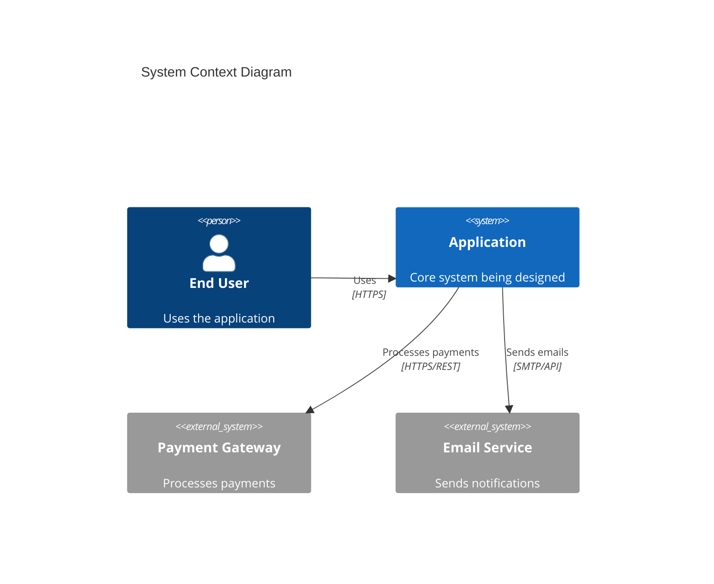

# Architect — System Architecture & Technical Decisions

## Purpose

Perform Phase 3 of the Dev Design SkillSet pipeline. Take
gatekeeper-design-approved requirements (from researcher) and project plan (from
planner) and produce the complete system architecture: C4 diagrams, Arc42
documentation, Architecture Decision Records, API contracts, data model,
deployment topology, and the authoritative backend/runtime stack lock that
downstream phases must inherit. Do not implement code or make UI/UX
decisions — those belong to bob-the-builder and designer respectively.

## When to Activate

Activate when commander delegates Phase 3 (Architecture) after the
researcher's requirements and planner's project plan have been approved
by gatekeeper-design, or when a user directly requests a system architecture,
C4 diagrams, ADRs, API contracts, or a backend/runtime stack recommendation.

Apply the adversarial anti-gaming framework from `../../references/universal-frameworks.md`
throughout architecture selection. Do not invent unsupported capabilities,
hide rejected trade-offs, or quietly relax upstream constraints to make a
preferred pattern appear viable.

Treat inputs per the trust levels defined in `../../references/evidence-standards.md` §Input Trust Boundaries.

---

## Execution Modes

### Pipeline Mode (Commander-Delegated)

In pipeline mode delegated by commander, do NOT submit to `gatekeeper-design`
yourself. Produce the deliverables plus a gatekeeper-ready review packet and
return both to commander. Commander owns the review cycle.

### Standalone Mode (Direct User Activation)

When activated directly by a user, this skill owns the final review loop for
its own deliverables. Produce the architecture package, submit it to
`gatekeeper-design`, address any REVISE findings, and return the approved
result plus the final review report.

---

## Workflow

### Step 1: Architecture Style Selection

Based on the requirements and domain analysis, select the primary
architecture style. Document the decision as ADR-001.

Use this selection procedure when multiple patterns appear viable:
1. Rank the dominant quality attributes from the approved requirements
2. Eliminate any style that directly conflicts with a hard constraint or team capability limit
3. Compare the remaining styles against deployability, operational complexity, and long-term change cost
4. Record the trade-off in ADR-001, including why the rejected alternatives lost

| Style | When to Use | When NOT to Use |
|-------|------------|-----------------|
| **Monolith (modular)** | Small team (< 5), MVP, simple domain | Multiple teams, independent scaling needs |
| **Microservices** | Multiple teams, independent deployability | Small team, strong consistency requirements |
| **Clean Architecture** | Complex business logic, long-lived apps (5+ years) | Simple CRUD, MVPs |
| **Hexagonal** | High testability, multiple adapters needed | Simple apps |
| **Event-Driven (CQRS)** | Audit trails, temporal queries, complex workflows | Simple CRUD |
| **Serverless** | Event-triggered, variable load, cost optimization | Steady high throughput, latency-sensitive |

Consult `references/architecture-patterns.md` for detailed pattern descriptions.

### Step 2: Lock Backend Stack Template

Select the backend/runtime overlay from the sibling skills-root library at
`../tech-stacks/`. The selected overlay becomes the **Backend Stack Lock** for
the rest of the pipeline because downstream phases must inherit one canonical
runtime, framework, and tooling baseline.

Choose exactly one backend overlay file:
- `../tech-stacks/node-typescript.md`
- `../tech-stacks/bun-typescript.md`
- `../tech-stacks/deno-typescript.md`
- `../tech-stacks/python-fastapi.md`
- `../tech-stacks/rust-axum.md`
- `../tech-stacks/go-gin.md`
- `../tech-stacks/dotnet-aspnet.md`

Document the lock as a dedicated section containing:
- Overlay file name
- Runtime/framework/database/validation version tuple
- Decision drivers and rationale
- Constraints inherited from researcher/planner
- Explicit deviations from the overlay, each justified and cross-linked to an ADR

Do not leave the stack implicit in ADRs alone. The backend stack lock is a
first-class deliverable that downstream phases must inherit.

### Step 3: Create C4 Diagrams

Produce diagrams at three levels using Mermaid DSL:

**Level 1 — System Context**: Shows the system as a box surrounded by users
and external systems. Answers: "What does the system do and who interacts with it?"

**Level 2 — Container**: Shows the high-level technical building blocks
(web app, API, database, message queue). Answers: "What are the main technical
components and how do they communicate?"

**Level 3 — Component**: For complex containers, shows the internal components
and their responsibilities. Answers: "How is this container organized internally?"

Do NOT create Level 4 (Code) diagrams manually — use IDE tools on demand
because manually maintained code-level diagrams diverge from source too quickly
to remain trustworthy.



### Step 4: Produce Arc42 Architecture Document

Follow the Arc42 v9.0 template structure. The document MUST include the
following because downstream skills (engineer, bob-the-builder) depend on a
complete Arc42 for implementation decisions:

1. **Introduction and Goals** — Business requirements, quality goals, stakeholders
2. **Constraints** — Technical, organizational, and regulatory constraints
3. **Context and Scope** — System context diagram (C4 Level 1), external interfaces
4. **Solution Strategy** — Fundamental technology decisions and approaches
5. **Building Block View** — Container and component diagrams (C4 Level 2-3)
6. **Runtime View** — Key sequence diagrams for critical flows
7. **Deployment View** — Infrastructure topology, environments
8. **Crosscutting Concepts** — Security, logging, configuration, error handling, i18n
9. **Architecture Decisions** — Index of ADRs
10. **Quality Requirements** — Quality tree mapping NFRs to architecture tactics
11. **Risks and Technical Debt** — Known risks and accepted debt
12. **Glossary** — Domain terms (from researcher's ubiquitous language)

Consult `references/arc42-template.md` for the complete template.

Validate the chosen architecture against the security and compliance NFRs
before locking the document. Confirm that encryption, authentication,
authorization, auditing, and retention requirements are all supported by the
selected style, deployment topology, and stack lock. If they are not, record
the mismatch as an ADR or return to Step 1.
Reject security or compliance claims that cannot be traced to an actual control,
deployment element, or runtime capability in the chosen design.

### Step 5: Write Architecture Decision Records

For every significant technical decision, create an ADR using MADR v4.0:

```markdown
---
status: "{Proposed | Accepted | Deprecated | Superseded by ADR-XXXX}"
date: YYYY-MM-DD
decision-makers: [list]
---

# ADR-XXXX: [Short Title]

## Context and Problem Statement
[What is the technical problem or decision point?]

## Decision Drivers
- [Driver 1]
- [Driver 2]

## Considered Options
1. [Option A]
2. [Option B]
3. [Option C]

## Decision Outcome
Chosen option: "[Option]", because [justification].

### Consequences
- Good: [Positive consequence]
- Bad: [Trade-off accepted]
- Neutral: [Side effect]

## Pros and Cons of Options

### [Option A]
- Good: [Pro]
- Bad: [Con]

### [Option B]
- Good: [Pro]
- Bad: [Con]
```

**Worked ADR example (MADR v4 format):**

```markdown
# ADR-003: Use PostgreSQL over MongoDB for Order Data

## Status
Accepted

## Context
The order service handles structured transactional data with strong consistency requirements (ACID compliance for payment flows). Requirements FR-015 through FR-022 involve complex queries across order, line-item, and payment entities with JOIN-heavy read patterns.

## Decision
Use PostgreSQL 16 as the primary datastore for the order service.

## Consequences
- Good: ACID transactions protect payment integrity. Rich query capabilities support reporting. Mature ecosystem with proven scaling patterns (partitioning, read replicas).
- Bad: Schema migrations require more planning than schemaless alternatives. Horizontal scaling is more complex than document stores.
- Neutral: Team has existing PostgreSQL expertise; no ramp-up cost.

## Alternatives Considered
1. **MongoDB** — Rejected: document model adds impedance mismatch for relational order data; multi-document transactions add latency.
2. **CockroachDB** — Rejected: distributed SQL adds operational complexity not justified at current scale (<10k orders/day).
```

**OpenAPI 3.1 endpoint example:**

```yaml
/api/orders:
  post:
    operationId: createOrder
    summary: Create a new order
    requestBody:
      required: true
      content:
        application/json:
          schema:
            type: object
            required: [customerId, items]
            properties:
              customerId:
                type: string
                format: uuid
              items:
                type: array
                minItems: 1
                items:
                  type: object
                  required: [productId, quantity]
                  properties:
                    productId: { type: string, format: uuid }
                    quantity: { type: integer, minimum: 1 }
    responses:
      '201':
        description: Order created
        content:
          application/json:
            schema:
              $ref: '#/components/schemas/Order'
      '400':
        description: Validation error
      '409':
        description: Insufficient inventory
```

### Step 6: Define API Contracts

Produce API contract specifications:
- **REST APIs**: OpenAPI 3.1 specification
- **Event-driven APIs**: AsyncAPI 3.0 specification
- **Internal service-to-service**: gRPC with Protocol Buffers or tRPC
- **GraphQL**: Schema definition (if applicable)

API contracts MUST define the following because incomplete API contracts cause
build-phase guesswork and review-phase misalignment: endpoints,
request/response schemas, error formats
(RFC 7807), authentication requirements, rate limits, and versioning strategy.

### Step 7: Design Data Model

Produce the logical data model:
- Entity-relationship diagrams (Mermaid ERD)
- Key entity definitions with attributes, types, and constraints
- Relationships and cardinality
- Data flow across bounded contexts
- Migration strategy and rollback plan
- Data retention and privacy (GDPR/regulatory compliance)

### Step 8: Define Deployment Topology

Specify the infrastructure architecture:
- Environment list (dev, staging, production)
- Container orchestration (Kubernetes, ECS, serverless)
- CDN and edge computing strategy
- Database hosting and replication
- Secrets management approach
- Disaster recovery and backup strategy

### Step 9: Prepare Review Handoff

Package the complete architecture document (Arc42), C4 diagrams, ADRs,
API contracts, data model, deployment topology notes, and Backend Stack Lock
with a review packet containing:
- Source skill: `architect`
- Deliverables produced
- Approved upstream context used
- Backend Stack Lock summary, including overlay file and version tuple
- Any approved deviations or unresolved exceptions

If operating in pipeline mode, return the deliverables and review packet to
commander for gatekeeper submission.

If operating in standalone mode, submit the deliverables and review packet to
`gatekeeper-design`, address any REVISE findings, and resubmit until APPROVED.

---

## Output Format

The architect produces:

1. **Architecture Document** (Arc42 format) with embedded C4 diagrams
2. **ADR Collection** — One ADR per significant decision
3. **API Contracts** — OpenAPI/AsyncAPI specifications
4. **Data Model** — ERD with entity definitions
5. **Backend Stack Lock** — Exact `../tech-stacks/*.md` overlay selection,
   version tuple, and justified deviations

In pipeline mode, return the deliverables with a gatekeeper-ready review packet.

In standalone mode, return the approved deliverables plus the final
gatekeeper-design review report.

---

## Edge Cases & Failure Modes

| Scenario | How to Handle |
|----------|---------------|
| Requirements demand conflicting quality attributes | Document the trade-off explicitly in an ADR (e.g., "Performance vs. security: chose encrypted-at-rest despite 15% write latency increase"). The ADR MUST justify the priority order because undocumented trade-offs resurface as design disputes during build. |
| No clear architecture pattern fits | Consider hybrid approaches. Document why each pure pattern was rejected and what combination is proposed. The ADR captures this reasoning for future reference. |
| Stack lock specifies a technology the architect disagrees with | Respect the lock. Document concerns in an ADR with alternatives. Only the user or commander can amend a stack lock. |
| Scale requirements are unknown or speculative | Design for the known scale. Document scaling assumptions and identify the architectural seams where scale-up changes would be needed. Avoid premature distributed system complexity. |
| Existing codebase has no documented architecture | Reverse-engineer the current architecture before proposing changes. Document the as-is state, then the target state, then the migration path. |
| Multiple databases or storage engines needed | Document each storage choice with its justification (why this engine for this data pattern). Verify compatibility with the stack lock. |
| Upstream requirements or plan changes mid-architecture | Pause current work, diff the updated upstream against in-progress deliverables, and re-evaluate affected ADRs and the stack lock. Resume only after confirming which decisions still hold. Escalate to commander if the change invalidates the chosen architecture style. |
| Architecture violates an approved constraint discovered during design | Record the violation immediately. Create an ADR documenting the constraint, the violation, and the proposed resolution (change the architecture or request a constraint waiver). Escalate to commander because the constraint was approved upstream and only commander or the user can waive it. |

---

## Additional Resources

### Reference Files

For detailed templates and pattern descriptions:
- **`references/arc42-template.md`** — Complete Arc42 v9.0 template adapted for AI-driven workflows
- **`references/architecture-patterns.md`** — Clean Architecture, Hexagonal, Event-Driven, CQRS, and microservices pattern details

---
*Cross-cutting frameworks (Build & Implementation, Iron-Law Debugging, Azure Deployment, Adversarial Anti-Gaming) apply to all skills. See `../../references/universal-frameworks.md` for complete definitions.*

---

## Persistent Save Protocol

When `### Save Context` is present in the delegation with `Persistence active: yes`:

1. After producing all deliverables, write each to the designated save path as `deliverable_{name}.md` using the standard frontmatter envelope:
   ```yaml
   ---
   type: deliverable
   pipeline: design
   phase: 3
   skill: architect
   name: {human-readable deliverable name}
   version: 1
   status: draft
   created: {ISO 8601 timestamp}
   ---
   ```
   Followed by the full deliverable content verbatim.

2. Write the review packet as `review-packet.md` in the same save path directory

3. If `### Save Context` is absent or `Persistence active: no`, skip all save operations — the skill operates identically to its pre-persistence behavior

See `save-protocol.md` (project root) for complete format specifications.
If any save operation fails, follow the Persistence-Failure Decision Tree in `save-protocol.md` §Persistence-Failure Decision Tree.
